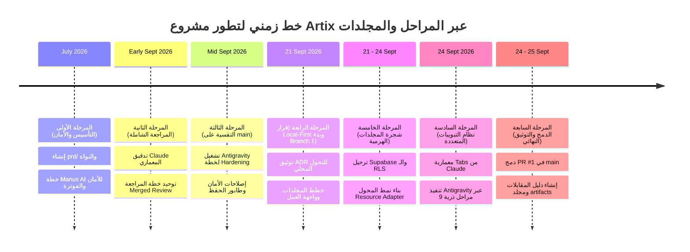
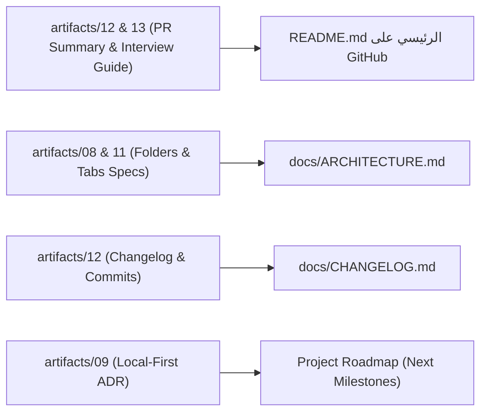

# 🗺️ الجدول الزمني الشامل لمراحل مشروع Artix وتحليل المجلدات والخطط التنفيذية
### (Artix Lifecycle Master Time Table, Folder Architecture & Artifacts Analysis)

---

## 📌 الفهرس
1. [المقدمة والغرض من هذا الدليل](#1-المقدمة-والغرض-من-هذا-الدليل)
2. [الجدول الزمني الرئيسي لمراحل المشروع (Master Project Lifecycle Time Table)](#2-الجدول-الزمني-الرئيسي-لمراحل-المشروع-master-project-lifecycle-time-table)
3. [التحليل الشامل لجميع مجلدات المشروع (Deep Folder Architecture Analysis)](#3-التحليل-الشامل-لجميع-مجلدات-المشروع-deep-folder-architecture-analysis)
   - [`artifacts/` (مجلد الأرشيف الزمني للخطط التنفيذية)](#-1-مجلد-artifacts-الأرشيف-الزمني-الموحد)
   - [`documentaion monetorization/` (مجلد التجميع والخطط المرجعية)](#-2-مجلد-documentaion-monetorization)
   - [`prd/` (مجلد وثائق متطلبات المنتج)](#-3-مجلد-prd)
   - [`docs/` (مجلد التوثيق الفني الحي)](#-4-مجلد-docs)
   - [`supabase/` (مجلد البنية التحتية وقواعد البيانات)](#-5-مجلد-supabase)
   - [`src/` (مجلد كود التطبيق الأساسي)](#-6-مجلد-src)
4. [تحليل وفهرسة خطط مجلد `artifacts/` بالترتيب الزمني](#4-تحليل-وفهرسة-خطط-مجلد-artifacts-بالترتيب-الزمني)
5. [خارطة طريق تحديث وثائق المشروع على GitHub (Documentation Update Roadmap)](#5-خارطة-طريق-تحديث-وثائق-المشروع-على-github)

---

## 1. المقدمة والغرض من هذا الدليل

مر مشروع **Artix** برحلة هندسية غنية ومعقدة؛ حيث تم بناؤه ومراجعته وتطويره عبر مراحل متتابعة بواسطة فريق عمل الذكاء الاصطناعي (**Manus AI**، ثم **Claude**، ثم **Antigravity**) بالتعاون والتوجيه الهندسي منك.

مع تراكم الخطط التنفيذية (Implementation Plans)، ومراجعات الأمان (Audits)، والقرارات المعمارية (ADRs) في مجلد `documentaion monetorization`، أصبح من الضروري:
1. **إنشاء مجلد منظم ومفهرس زمنياً `artifacts/`** يضم كل الخطط التنفيذية والمراجعات بترقيم دقيق (`01_` إلى `13_`).
2. **وضع جدول زمني (Time Table) دقيق** يوضح متى وأين ولماذا تم استخدام كل مجلد وكل ملف.
3. **تقديم مرجع تحليلي متكامل** تستند عليه عند صياغة وتحديث وثائق المشروع الرسمية على GitHub (`README.md`, `docs/`, `Wiki`).

---

## 2. الجدول الزمني الرئيسي لمراحل المشروع (Master Project Lifecycle Time Table)

| المرحلة (Stage) | التاريخ الزمني | الفاعل الرئيسي (Actor) | المجلدات المستخدمة | المخرجات والقرارات المعمارية الأساسية |
| :--- | :---: | :---: | :--- | :--- |
| **المرحلة 1: التأسيس والأمان الأولي (Genesis & Remediation)** | 07 - 24 يوليو 2026 | **Manus AI** & المؤسس | `prd/`, `supabase/`, `src/` | • كتابة متطلبات المنتج الفنية والـ Vibe Coding Playbook. • إنشاء النواة الأولى للمحرر والرسم البياني. • تدقيق أمني وخطة علاجية (`01_Manus_Remediation_Plan`) لحل خطأ بوابة الفوترة وتشفير مفاتيح الـ AI. |
| **المرحلة 2: المراجعة الهندسية الشاملة (Engineering Review)** | 07 - 09 سبتمبر 2026 | **Claude** | `documentaion monetorization/` | • مراجعة عميقة للكود (`02_Claude_Engineering_Review`). • فرز المشاكل إلى 4 مراحل واضحة وتوحيدها في التقرير النهائي (`03_Claude_Merged_Engineering_Review`). |
| **المرحلة 3: التقسية البرمجية على main (Production Hardening)** | 11 - 21 سبتمبر 2026 | **Antigravity** | `src/`, `docs/`, `supabase/` | • إعداد خطة التنفيذ الكبرى بـ 82KB (`04_Antigravity_Hardening_Implementation_Plan`). • حل ثغرات التشفير وأمان البيانات، وبناء Save Queue. • تدقيق الاختبارات (`06_Test_Audit`) لضمان عدم وجود فحوصات وهمية. • وضع معايير مزامنة التوثيق (`05_Docs_Sync_Directive`). |
| **المرحلة 4: قرار Local-First وبدء Branch 1** | 21 سبتمبر 2026 | **Claude** & **Antigravity** | `docs/`, `artifacts/` | • تدقيق آلية الحفظ القديمة واكتشاف عيوب `sendBeacon` و `localStorage`. • كتابة واعتماد قرار التحول المعماري (`09_Local_First_Architecture_Shift_ADR`). • فتح فرع `feat/project-workspace-ux` وكتابة خطط شجرة المجلدات (`07`, `08`). |
| **المرحلة 5: شجرة المجلدات وواجهة Workspace** | 21 - 24 سبتمبر 2026 | **Antigravity** | `supabase/migrations/`, `src/components/`, `src/lib/` | • تنفيذ ترحيل SQL `workspace_folders` مع سياسات RLS. • بناء محول الموارد الموحد `resourceAdapter.ts` وشجرة التكرار `groupResourcesByFolder.ts`. • بناء منع تكرار الأسماء بالترقيم التلقائي (Smart Auto-Increment). |
| **المرحلة 6: معمارية التبويبات المتعددة (Tabs Subsystem)** | 24 سبتمبر 2026 | **Claude** (معمارية) + **Antigravity** (تنفيذ) | `src/hooks/`, `src/lib/workspace/`, `src/test/` | • وثيقة Claude لمعمارية التبويبات (`10_Tabs_Architecture_Guide`). • خطة Antigravity التنفيذية عبر 9 مراحل (`11_Tabs_Execution_Plan`). • تنفيذ التبويبات كدوال نقية + مزامنة الرابط + تتبع التعديلات (●) + حوار الحماية + اختصارات لوحة المفاتيح. |
| **المرحلة 7: الدمج والتوثيق ودليل المقابلات (PR #1 & Release)** | 24 - 25 سبتمبر 2026 | **Antigravity** & أنت | `artifacts/`, `docs/`, الجذر | • توثيق الـ PR الشامل (`12_PR_DESCRIPTION.md`). • دمج الـ 26 كوميت بنجاح في `main` على GitHub. • كتابة دليل المقابلات التقنية بالعربية (`13_PR1_Interview_Mastery`). • إنشاء وأرشفة مجلد `artifacts/`. |

---

## 3. التحليل الشامل لجميع مجلدات المشروع (Deep Folder Architecture Analysis)

### 🗂️ 1. مجلد `artifacts/` (الأرشيف الزمني الموحد)
* **المسار:** `c:\Fenix-main\artifacts`
* **تاريخ الإنشاء:** 25 سبتمبر 2026.
* **الهدف المعماري:** مستودع مركزي نهائي، يجمع كل وثائق القرارات الهندسية (ADRs)، مراجعات الأمان، وخطط التنفيذ التي صاغها Manus AI و Claude و Antigravity عبر تاريخ المشروع.
* **كيفية الاستخدام:**
  - كل ملف يحمل ترقيماً تسلسلياً زمنيّاً (`01_` إلى `13_`) مع تاريخه واسم الجهة التي كتبته.
  - يحتوي على `README.md` كفهرس إرشادي يربط كل خطة بمكان تنفيذها في الكود.

---

### 📦 2. مجلد `documentaion monetorization/`
* **المسار:** `c:\Fenix-main\documentaion monetorization`
* **تاريخ الاستخدام:** سبتمبر 2026.
* **الهدف والتحليل:**
  - كان هذا المجلد بمثابة "مساحة عمل وسيطة وتجميعية" (Staging / Working Directory) جمعت فيها ملفات الخطط والمراجعات التي صدرت من نماذج الذكاء الاصطناعي المختلفة قبل تصنيفها.
  - **ملاحظة إدارية:** بعد أن قمنا بنسخ وترتيب كل الخطط التنفيذية داخل `artifacts/` بترقيم تاريخي نظيف، فإن مجلد `documentaion monetorization` يمكن تركه كأرشيف للملفات الخام، أو تنظيفه لعدم تكرار الملفات.

---

### 📄 3. مجلد `prd/` (وثائق متطلبات المنتج)
* **المسار:** `c:\Fenix-main\prd`
* **تاريخ الإنشاء:** يوليو 2026.
* **الملفات الموجودة:**
  1. `ARTIX_PRODUCT_REQUIREMENTS_DOCUMENT.md`: الرؤية الأولية للمنتج، الفئات المستهدفة، وخطة الفوترة (Free vs Pro).
  2. `TECHNICAL_SPECIFICATIONS.md`: المواصفات التقنية الأولية للبنية التحتية، التقنيات (Vite, React, Tailwind, Supabase).
  3. `VIBE_CODING_PLAYBOOK.md`: كتيب أسلوب البرمجة السريعة والتوجيه التفاعلي للـ AI.
* **الدور عند تحديث وثائق GitHub:**
  - يُستفاد منه في استخراج الرؤية التسويقية (Value Proposition) لوضعها في مقدمة `README.md` الرئيسي على GitHub.

---

### 📚 4. مجلد `docs/` (التوثيق التقني الحي للمشروع)
* **المسار:** `c:\Fenix-main\docs`
* **تاريخ الاستخدام:** يواكب المشروع في كل مراحله (محدث باستمرار).
* **الملفات الموجودة ودورها:**
  1. `ARCHITECTURE.md`: الهيكل العام للنظام ومسار تدفق البيانات.
  2. `API.md`: عقود الدوال مع Supabase والـ Edge Functions.
  3. `TESTING.md`: فلسفة الاختبارات ومعايير الـ 329 فحص في Vitest.
  4. `UI_UX_GUIDELINES.md`: نظام التصميم الداكن (Dark Glassmorphic UI) وتفاعلات Framer Motion.
  5. `PROJECT_FILE_STRUCTURE.md`: خريطة ملفات المستودع بالكامل.
  6. `CHANGELOG.md`: سجل الإصدارات التاريخي.
  7. `LOCAL_FIRST_ARCHITECTURE_SHIFT.md`: الوثيقة المعمارية المعتمدة للتحول القادم نحو IndexedDB.
  8. `CHALLENGES_AND_SOLUTIONS.md`: سجل أصعب التحديات التقنية وحلولها.
* **الدور عند تحديث وثائق GitHub:**
  - هذا المجلد هو قلب وثائق المشروع الفنية على GitHub؛ يجب مراجعته وتحديث `ARCHITECTURE.md` و `CHANGELOG.md` ليعكسا نظام التبويبات والمجلدات التي دخلت في PR #1.

---

### ⚡ 5. مجلد `supabase/` (البنية التحتية الخلفية)
* **المسار:** `c:\Fenix-main\supabase`
* **المحتويات:**
  - `migrations/`:
    - `20260920120000_billing_schema.sql`: جداول الفوترة والاشتراكات لـ Stripe.
    - `20260923213000_workspace_folders.sql`: جدول `workspace_folders` (Adjacency List Tree) وسياسات الـ RLS.
  - `functions/`: دوال الحافة (Deno Edge Functions):
    - `create-checkout-session`, `stripe-webhook`, `create-portal-session`.
* **الدور عند تحديث وثائق GitHub:**
  - يتم الاستناد إليه لتوثيق الـ Database Schema في صفحة التوثيق الفني `docs/ARCHITECTURE.md`.

---

### 💻 6. مجلد `src/` (كود التطبيق الأساسي)
* **المسار:** `c:\Fenix-main\src`
* **أهم المكونات المضافة حديثاً في PR #1:**
  - `src/lib/workspace/`: المنطق النقي للملفات والمجلدات والتبويبات (`workspaceTabs.ts`, `dirtyTracker.ts`, `tabPersistence.ts`, `resourceAdapter.ts`, `groupResourcesByFolder.ts`).
  - `src/hooks/`: الهوكات التفاعلية (`useWorkspaceTabs.ts`, `useWorkspaceFolders.tsx`, `useWorkspaceKeyboard.ts`, `useWorkspaceNavigation.ts`).
  - `src/components/ProjectWorkspace/`: مكونات الواجهة (`WorkspaceTabBar`, `WorkspaceTabItem`, `WorkspaceFolderItem`, `ProjectWorkspaceSidebar`, `ProjectOverview`, `CloseTabConfirmDialog`).
  - `src/test/`: 41 ملف فحص تضم 329 اختباراً مؤتمتاً بنسبة نجاح 100%.

---

## 4. تحليل وفهرسة خطط مجلد `artifacts/` بالترتيب الزمني

| الرقم | الملف | التاريخ | المصدر | الملخص الفني والدور في المشروع |
| :---: | :--- | :---: | :---: | :--- |
| **01** | `01_2026-07-23_Manus_Remediation_Plan.md` | 2026-07-23 | Manus AI | وثيقة معالجة العوائق الأمنية والوظيفية الأولى: حل مشكلة الخطأ 400 في بوابة الاشتراكات، وجعل تشفير مفاتيح API إجبارياً، وحماية CORS في دوال Supabase. |
| **02** | `02_2026-09-07_Claude_Engineering_Review_and_Fix_Checklist.md` | 2026-09-07 | Claude | الفحص الشامل الأعمق للكود؛ كشف مشاكل سباق حفظ البيانات (Race Conditions)، قيود localStorage، ونقاط الضعف في الاختبارات السطحية. |
| **03** | `03_2026-09-09_Claude_Merged_Engineering_Review_Final.md` | 2026-09-09 | Claude | وثيقة توحيد المراجعات؛ وضعت خارطة الطريق الرسمية المقسمة إلى 4 مراحل (Security, Persistence Resilience, Billing, Quality/Docs). |
| **04** | `04_2026-09-11_Antigravity_Hardening_Implementation_Plan.md` | 2026-09-11 | Antigravity | الخطة التنفيذية الأضخم (82 كيلوبايت)؛ قادت تنفيذ عمليات التقسية على فرع `main`: تشفير المفاتيح، طابور الحفظ المتسلسل، وواجهات استعادة الأخطاء. |
| **05** | `05_2026-09-20_Claude_Documentation_Sync_Directive.md` | 2026-09-20 | Claude | ميثاق حوكمة التوثيق؛ يلزم بمزامنة أي تغيير في الكود مع الرسوم البيانية وملفات الماركدوان وفحوصات الاختبارات في وقت واحد. |
| **06** | `06_2026-09-21_Antigravity_Test_Audit_and_Improvement_Plan.md` | 2026-09-21 | Antigravity | خطة فحص وتصحيح الاختبارات؛ الإجابة العملية على سؤال: "هل يمكن أن يفشل النظام وتظل الاختبارات خضراء؟"، وتحويل الـ Mocks الوهمية لاختبارات سلوكية حقيقية. |
| **07** | `07_2026-09-21_Claude_Branch1_Workspace_UX_Implementation_Plan.md` | 2026-09-21 | Claude | خطة هندسة واجهة بيئة العمل الموحدة لفرع `feat/project-workspace-ux`؛ توحيد شاشة الوثائق والتصميمات في Shell واحد متجاوب. |
| **08** | `08_2026-09-21_Claude_Branch1_Folder_System_Implementation_Plan.md` | 2026-09-21 | Claude | الخطة التفصيلية لنظام المجلدات الهرمي: جدول قاعدة البيانات، السحب والإفلات، نافذة النقل، والتحقق من فرادة الأسماء بالترقيم التلقائي. |
| **09** | `09_2026-09-21_Antigravity_Local_First_Architecture_Shift_ADR.md` | 2026-09-21 | Antigravity | قرار التصميم المعماري (ADR): إيقاف ترقيع الحفظ القديم ورفض إرسال الـ Beacons عبر الشبكة، والتخطيط للتحول نحو IndexedDB + Outbox Pattern. |
| **10** | `10_2026-09-24_Claude_Workspace_Tabs_Architecture_Guide.md` | 2026-09-24 | Claude | الدليل المعماري لنظام التبويبات المتعددة؛ حدد تجربة المستخدم المشابهة لـ VS Code و Obsidian وسلوكيات الروابط ومؤشر التعديل. |
| **11** | `11_2026-09-24_Antigravity_Workspace_Tabs_Execution_Plan.md` | 2026-09-24 | Antigravity | خطة التنفيذ الجراحية لنظام التبويبات؛ قسمت العمل إلى 9 مراحل ذرية محكمة نُفذت بدون أي أخطاء أو اضطراب في الكود القائم. |
| **12** | `12_2026-09-24_Antigravity_PR1_Description_and_Release_Notes.md` | 2026-09-24 | Antigravity | الوثيقة الكاملة لتفاصيل الدمج (PR Description) لـ 26 كوميت و 54 ملفاً، والتي تم نشرها في Pull Request #1 على GitHub. |
| **13** | `13_2026-09-24_Antigravity_PR1_Interview_Mastery_Guide_AR.md` | 2026-09-24 | Antigravity | الدليل العربي الشامل لاجتياز المقابلات التقنية؛ يحلل أسرار المعمارية، حلول أصعب المشاكل البرمجية، و10 أسئلة كلاسيكية مع إجاباتها النموذجية. |

---

## 5. خارطة طريق تحديث وثائق المشروع على GitHub (Documentation Update Roadmap)

عند قيامنا بتحديث ملفات التوثيق على GitHub، سنتبع هذا المسار المباشر مستندين إلى الـ `artifacts`:

### 1. تحديث `README.md` الرئيسي:
* إضافة قسم: **Desktop-Grade Workspace & Tabs Subsystem** مع مميزات التبويبات، شجرة المجلدات الهرمية، واختصارات لوحة المفاتيح.
* تحديث شارة الفحوصات (Badges): الإشارة إلى وجود **329 فحص آلي ناجح بنسبة 100%**.

### 2. تحديث `docs/ARCHITECTURE.md`:
* إضافة المخطط البياني لشجرة المجلدات ونموذج الـ Adjacency List.
* إضافة مخطط تدفق نظام التبويبات والمحرر النشط (Single-Mount Active Editor).
* توثيق نمط المحول الموحد `WorkspaceResource` ومزاياه الهندسية.

### 3. تحديث `docs/CHANGELOG.md`:
* تسجيل الإصدار الأخير (PR #1): توثيق الـ 26 كوميت والتغييرات الجوهرية وتاريخ الدمج الرسمي.

### 4. تحديث `docs/ROADMAP.md`:
* إغلاق مرحلة الـ Workspace UX واعتبارها منجزة بنسبة 100%.
* وضع المرحلة القادمة كأولوية قصوى: **المرحلة 8: محرك العمل بدون اتصال Local-First & Offline Engine (IndexedDB + Outbox)**.
