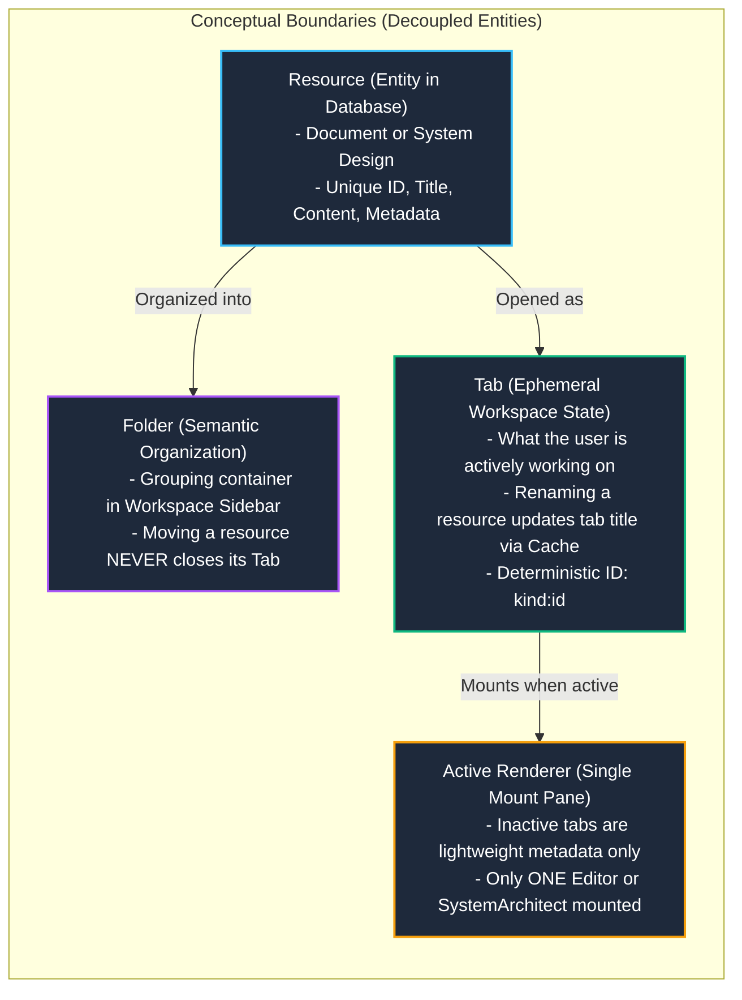
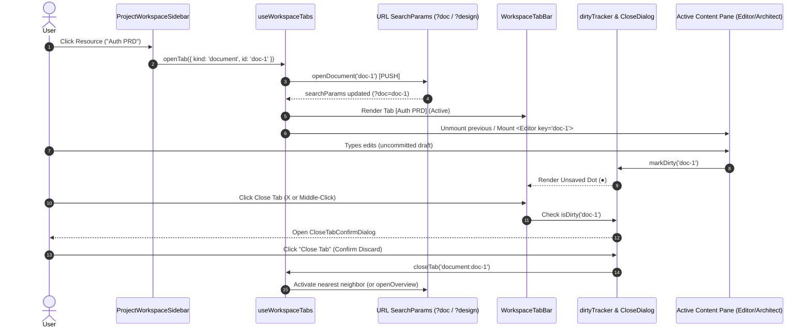

# PR: Epic Workspace Transformation — Unified Shell, Hierarchical Folders, and Multi-Tab Subsystem

**Branch:** `feat/project-workspace-ux` ➔ `main`  
**Commits:** `ac58832..e9f4e60` (26 Commits)  
**Diff Stats:** `54 files changed, +7,086 insertions(+), -367 deletions(-)`  
**Test Suite:** `329/329 passing (41 test files, 100% green)`  
**Build Status:** `tsc --noEmit (0 errors) | eslint (0 errors) | vite build (success)`

---

## 📖 Executive Summary

This Pull Request represents a comprehensive architectural evolution of the Artix product workspace. It transitions Artix from a fragmented, single-page view into a **desktop-grade engineering workspace** inspired by **VS Code, Obsidian, and Linear**.

### Core Milestones Delivered:
1. **Unified Workspace Shell & Responsive Navigation:** A normalized 4-tier resource view model, persistent collapsible sidebar, mobile drawer, embedded document & design editors, and URL-driven deep-linking.
2. **Hierarchical Folder Organization System:** Full database schema migration, Supabase RLS policies, folder-first sidebar tree view, and strict uniqueness validation (case-insensitive deduplication for folders and resources).
3. **Obsidian / VS Code-like Workspace Tabs Subsystem:** Multi-resource tab bar with single-mount active editor performance, project-scoped persistence (`artix.workspace.tabs.${projectId}`), two-tier dirty tracking (`●`), close confirmation protection, keyboard navigation (`Ctrl+W`, `Ctrl+Tab`, `Ctrl+1..9`), and middle-click closing.

---

## 🗺️ Architectural Maps & System Diagrams

### 1. Conceptual Domain Boundaries (Strict Invariant Separation)



---

### 2. Tab Lifecycle, URL Synchronization, and Editor Mount Strategy



---

## 📦 Detailed Breakdown of the 26 Commits

### Pillar I — Unified Workspace Shell & Navigation Architecture (Commits 1–9)

* **`ac58832` `refactor(workspace): add normalized resource view model and 4-tier pure adapter (Phase 1)`**
  * Introduces the normalized `WorkspaceResource` domain model and a 4-tier pure adapter pipeline (`resourceAdapter.ts`) transforming heterogeneous Supabase `documents` and `system_designs` rows into uniform collections with sort, filter, and metadata extraction.
* **`46aa7bd` `feat(workspace): add persistent project sidebar and responsive shell (Phase 2)`**
  * Implements `ProjectWorkspaceLayout` and `ProjectWorkspaceSidebar` with desktop persistent collapsible drawer, mobile overlay sheet via Radix UI, project switching shortcut, and filter toggles (`all` | `document` | `design`).
* **`ad79b80` `feat(workspace): add project overview landing page (Phase 3)`**
  * Introduces `ProjectOverview.tsx` landing canvas displaying project health metrics, quick-create action cards, and chronological recent resource feeds.
* **`0826050` `feat(workspace): unify project workspace navigation and embed resource editors (Phase 4 & 5)`**
  * Replaces route-jumping with embedded resource rendering. Introduces `useWorkspaceNavigation` hook enforcing URL search param contracts (`?doc=X`, `?design=Y`), mutual exclusivity canonicalization, and history push/replace semantics.
* **`726bb0a` `fix(workspace): add stable resource keys to Editor and SystemArchitect and add regression tests`**
  * Prevents state leakage when switching between consecutive resources of the same kind by anchoring `<Editor key={activeDocument.id} />` and `<SystemArchitect key={activeDesign.id} />`.
* **`c1283c7` `fix(workspace): resolve race condition between resource creation and canonicalization effect`**
  * Solves asynchronous cache invalidation races using a session-scoped `recentlyCreatedRef`, suppressing false-positive "Document not found" toasts upon resource creation.
* **`7864aa1` `test(correctness): improve navigation history traversal, XSS rendering, and audit fidelity`**
  * Hardens test harness verifying browser back/forward history semantics (`PUSH` for resources, `REPLACE` for overview).
* **`cbe62f3` `test(security): enforce non-null anchor assertion in MarkdownPreview XSS test`**
  * Security hardening ensuring DOMPurify sanitization strictly strips malicious payloads in markdown preview.
* **`e9b2851` `feat(editor): add toggle option for markdown preview pane with localStorage persistence`**
  * Adds split-pane / editor-only toggle button in Monaco toolbar with persistence key `artix.editor.preview.open`.

---

### Pillar II — Hierarchical Folder Organization System (Commits 10–17)

* **`7367b17` `feat(db): add workspace_folders migration and supabase types contract`**
  * Creates `workspace_folders` PostgreSQL table with RLS policies, cascade deletes, updated_at trigger, and composite foreign keys `folder_id` on `documents` and `system_designs`.
* **`99892f8` `feat(domain): add folderId to WorkspaceResource, Document, and adapter`**
  * Propagates nullable `folderId` throughout core TypeScript types, entity mappings, and adapter outputs.
* **`5f3e27a` `feat(hooks): add useWorkspaceFolders hook and support folder_id in documents/designs`**
  * TanStack Query mutation hook for folder CRUD operations with optimistic cache invalidation.
* **`58464c9` `feat(workspace): add groupResourcesByFolder pure utility and comprehensive tests`**
  * Pure grouping utility partitioning resources into folder buckets and root lists with orphaned folder fallback.
* **`47de4bc` `feat(ui): implement folder-first sidebar, folder items, and move dialog`**
  * Renders expandable tree folder structure (`WorkspaceFolderItem.tsx`), inline folder actions, and modal move dialog (`WorkspaceMoveResourceDialog.tsx`).
* **`3962606` `feat(overview): simplify ProjectOverview and wire folder actions in workspace shell`**
  * Integrates folder creation directly into the ProjectOverview dashboard and workspace command palette.
* **`3b7a7f4` `feat(workspace): enforce unique folder names per project and add smart auto-naming`**
  * Enforces case-insensitive folder uniqueness (`lower(trim(name))`) via database unique index and UI pre-validation with smart sequential naming (`New Folder`, `New Folder 2`, etc.).
* **`962d855` `feat(workspace): enforce unique resource names per folder and add smart auto-naming`**
  * Enforces uniqueness for resources within the same folder or Root level across creation, renaming, and moving dialogs, with automatic smart suffixing.

---

### Pillar III — Obsidian / VS Code-like Workspace Tabs Subsystem (Commits 18–26)

* **`fcc64f4` `feat(workspace): add tab domain model and pure state transitions`**
  * Implements `workspaceTabs.ts` containing pure, immutable functions: `openTab`, `activateTab`, `closeTab`, `closeOtherTabs`, `closeAllTabs`, `reconcileTabs`, and `getNextTabAfterClose`. (32 unit tests).
* **`7e9b962` `feat(workspace): add tab persistence adapter`**
  * Project-isolated storage adapter (`tabPersistence.ts`) serializing tab lists under `artix.workspace.tabs.${projectId}` with schema validation and `QuotaExceededError` resilience. (10 unit tests).
* **`1f0f5b2` `feat(workspace): add useWorkspaceTabs hook with URL sync and persistence`**
  * Coordinates URL query params as single source of truth for active tab, restores persisted tabs, supports deep linking, and reconciles deleted resources. (14 unit tests).
* **`4b34fcf` `feat(workspace): add dirty state tracker for tab indicators`**
  * Reactive singleton `dirtyTracker.ts` using `useSyncExternalStore` combined with instant `localStorage` draft detection, wired into `useAutoSave` and `SystemArchitect`. (6 unit tests).
* **`deca3d4` `feat(workspace): add WorkspaceTabBar and WorkspaceTabItem components`**
  * Visual tab bar with dynamic title resolution, active tab indicators, unsaved modification dot (`●`), hover close button, and **mouse middle-click to close**. (9 component tests).
* **`f5635b1` `feat(workspace): integrate tab system into ProjectWorkspace shell`**
  * Wires tab bar into `ProjectWorkspaceLayout`, routes sidebar selection and creation handlers to `openTab`, and implements non-destructive Overview navigation.
* **`a2134ed` `feat(workspace): add dirty tab close protection`**
  * Accessible Radix `AlertDialog` modal (`CloseTabConfirmDialog.tsx`) prompting the user before closing any tab with unsaved edits. (3 component tests).
* **`5fa1375` `feat(workspace): add tab keyboard shortcuts`**
  * Centralized shortcut hook (`useWorkspaceKeyboard.ts`) supporting `Ctrl/Cmd + W`, `Ctrl/Cmd + Tab`, `Ctrl/Cmd + Shift + Tab`, and `Ctrl/Cmd + 1..9`, with modal dialog and text input focus guards. (9 unit tests).
* **`e9f4e60` `test(workspace): add comprehensive workspace tabs integration test suite`**
  * Complete end-to-end integration test suite (`workspaceTabsIntegration.test.tsx`) exercising user flows from sidebar to tabs, editing, dirty close protection, and Overview switching. (5 tests).

---

## 📑 Complete 26-Commit Table

| # | Hash | Scope | Description | Pillar |
|---|------|-------|-------------|--------|
| 1 | `ac58832` | `refactor(workspace)` | Add normalized resource view model and 4-tier pure adapter | Shell & Navigation |
| 2 | `46aa7bd` | `feat(workspace)` | Add persistent project sidebar and responsive shell | Shell & Navigation |
| 3 | `ad79b80` | `feat(workspace)` | Add project overview landing page | Shell & Navigation |
| 4 | `0826050` | `feat(workspace)` | Unify project workspace navigation and embed resource editors | Shell & Navigation |
| 5 | `726bb0a` | `fix(workspace)` | Add stable resource keys to Editor and SystemArchitect | Shell & Navigation |
| 6 | `c1283c7` | `fix(workspace)` | Resolve race condition between resource creation and canonicalization | Shell & Navigation |
| 7 | `7864aa1` | `test(correctness)` | Improve navigation history traversal, XSS rendering, and audit | Testing & Hardening |
| 8 | `cbe62f3` | `test(security)` | Enforce non-null anchor assertion in MarkdownPreview XSS test | Testing & Hardening |
| 9 | `e9b2851` | `feat(editor)` | Add toggle option for markdown preview pane with localStorage | Editor UX |
| 10 | `7367b17` | `feat(db)` | Add workspace_folders migration and supabase types contract | Folders |
| 11 | `99892f8` | `feat(domain)` | Add folderId to WorkspaceResource, Document, and adapter | Folders |
| 12 | `5f3e27a` | `feat(hooks)` | Add useWorkspaceFolders hook and support folder_id in documents/designs | Folders |
| 13 | `58464c9` | `feat(workspace)` | Add groupResourcesByFolder pure utility and comprehensive tests | Folders |
| 14 | `47de4bc` | `feat(ui)` | Implement folder-first sidebar, folder items, and move dialog | Folders |
| 15 | `3962606` | `feat(overview)` | Simplify ProjectOverview and wire folder actions in workspace shell | Folders |
| 16 | `3b7a7f4` | `feat(workspace)` | Enforce unique folder names per project and add smart auto-naming | Folders & Invariants |
| 17 | `962d855` | `feat(workspace)` | Enforce unique resource names per folder and add smart auto-naming | Folders & Invariants |
| 18 | `fcc64f4` | `feat(workspace)` | Add tab domain model and pure state transitions | Workspace Tabs |
| 19 | `7e9b962` | `feat(workspace)` | Add tab persistence adapter | Workspace Tabs |
| 20 | `1f0f5b2` | `feat(workspace)` | Add useWorkspaceTabs hook with URL sync and persistence | Workspace Tabs |
| 21 | `4b34fcf` | `feat(workspace)` | Add dirty state tracker for tab indicators | Workspace Tabs |
| 22 | `deca3d4` | `feat(workspace)` | Add WorkspaceTabBar and WorkspaceTabItem components | Workspace Tabs |
| 23 | `f5635b1` | `feat(workspace)` | Integrate tab system into ProjectWorkspace shell | Workspace Tabs |
| 24 | `a2134ed` | `feat(workspace)` | Add dirty tab close protection | Workspace Tabs |
| 25 | `5fa1375` | `feat(workspace)` | Add tab keyboard shortcuts | Workspace Tabs |
| 26 | `e9f4e60` | `test(workspace)` | Add comprehensive workspace tabs integration test suite | Testing & Hardening |

---

## 🔒 Architectural Guarantees & Domain Invariants

* **Strict URL Single Source of Truth:** `activeTabId` is derived exclusively from `?doc=` and `?design=`. Tab switching uses `PUSH` history semantics, allowing natural browser back/forward traversal.
* **Zero Multiple Editor Mounts:** Inactive tabs are pure metadata. Only the active document or design is mounted, avoiding memory exhaustion and duplicate Monaco workers.
* **Dynamic Title Resolution:** Tab items read titles dynamically from cached resource collections, guaranteeing immediate title updates upon rename without tab recreation.
* **Deterministic Tab Closing:** Closing an active tab selects the right neighbor; if closed tab was last, it selects the left neighbor; if no tabs remain, it falls back to Project Overview.
* **Non-Destructive Overview:** Navigating to Project Overview deactivates the current tab but leaves open tabs intact in the TabBar.
* **Two-Tier Autosave & Data Loss Prevention:** Keystrokes write instantly to Tier 1 (`localStorage` draft) and debounce to Tier 2 (Supabase). Attempting to close a tab with uncommitted changes triggers a confirmation modal.

---

## 🧪 Verification & Test Matrix

```text
================================================================================
Test Files  : 41 passed (41)
Tests       : 329 passed (329) — [88 new automated tests added in this PR]
TypeScript  : 0 errors (npx tsc --noEmit)
ESLint      : 0 errors
Vite Build  : Success in 8.78s (PWA precache 44 entries generated)
================================================================================
```

### Coverage by Subsystem:
* `src/test/workspace/workspaceTabs.test.ts` (32 tests) — Tab transitions & boundary math
* `src/test/workspace/tabPersistence.test.ts` (10 tests) — Storage adapter, quota safety & isolation
* `src/test/workspace/useWorkspaceTabs.test.tsx` (14 tests) — React hook lifecycle & URL sync
* `src/test/workspace/dirtyTracker.test.ts` (6 tests) — External store subscription & draft check
* `src/test/components/WorkspaceTabBar.test.tsx` (9 tests) — UI rendering, selection & middle-click
* `src/test/components/CloseTabConfirmDialog.test.tsx` (3 tests) — Dialog interactions & dismissal
* `src/test/hooks/useWorkspaceKeyboard.test.ts` (9 tests) — Keyboard hotkeys & focus guards
* `src/test/workspace/workspaceTabsIntegration.test.tsx` (5 tests) — End-to-end integration flows
* `src/test/workspace/workspaceFolders.test.tsx` (7 tests) — Folder CRUD & deduplication
* `src/test/workspace/ProjectWorkspaceNavigation.test.tsx` (16 tests) — Shell navigation contracts
