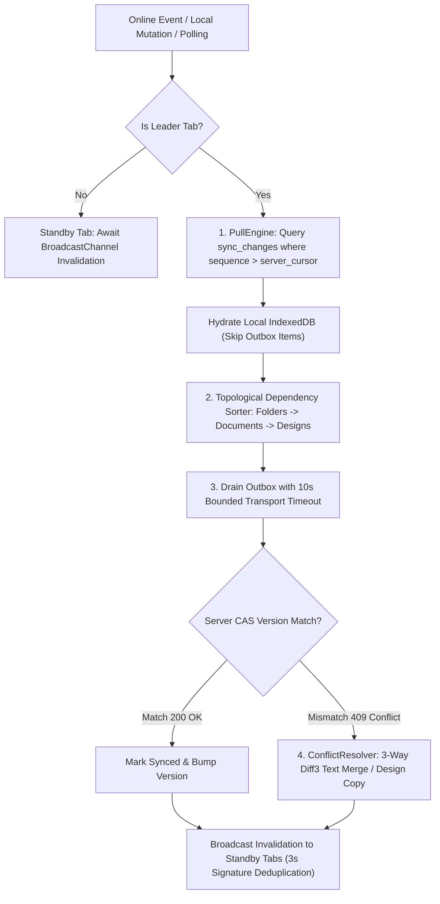

# PR: Hardened Local-First Offline Synchronization Engine

**Branch:** `feat/offline-first-hardening` ➔ `main`  
**Commits:** `9de6d26..72cd28a` (11 Phase-by-Phase Commits)  
**Diff Stats:** `54 files changed, +11,333 insertions(+), -864 deletions(-)`  
**Test Suite:** `505 / 505 passing (70 test files, 100% green)`  
**Verification:** `tsc --noEmit (0 errors) | eslint (0 errors) | vite build (success, 9.68s)`  
**Supabase Migrations Applied:**  
1. `20260928120000_server_concurrency_protocol.sql` (CAS Row Versioning & Processed Mutations)  
2. `20260928130000_durable_sync_changes.sql` (Durable Change Feed & Cursor Tracking)

---

## 📖 Executive Summary

This Pull Request delivers the complete **Local-First Synchronization Hardening Architecture** for Artix. It transitions all document, system design, and folder operations from fragile network-dependent direct cloud writes into an authoritative, desktop-grade local-first persistence engine backed by Dexie.js (IndexedDB).

Users can now create, edit, organize, and delete documents, folders, and architecture canvases completely offline. When network connectivity resumes, mutations drain in strict topological dependency order, guarded by Compare-and-Swap (CAS) row versioning, while missed cloud updates stream down via a durable server change feed and resolve through deterministic 3-way linear diff3 merging.

---

## 🗺️ Architectural Diagrams

### 1. Authoritative Local-First Write Boundary

```mermaid
flowchart LR
    UI["User Interface (Monaco Editor / React Flow / Sidebar)"] -->|Synchronous Action| Repo["Local Repository (Document / Design / Folder)"]
    
    subgraph DexieTx ["Atomic Dexie Transaction Boundary"]
        Repo -->|Put / Update| EntityTable[("Entity Table (IndexedDB)")]
        Repo -->|Enqueue / Compact| OutboxTable[("Outbox Table")]
        Repo -->|Update Revision| MetaTable[("Sync Metadata Table")]
    end
    
    Repo -->|Immediate Return (<2ms)| UI
    OutboxTable -.->|Background Drain| SyncEngine["SyncEngine (Single Tab Leader)"]
    SyncEngine -.->|HTTP / CAS Push| Supabase[("Supabase Cloud (PostgreSQL)")]
```

---

### 2. Synchronization & Convergence Engine



---

## 🏛️ Core Architectural Invariants Established

1. **Local-First Authority (Zero UI Blocking)**:
   - UI mutations in `useDocuments`, `useSystemDesigns`, and `useWorkspaceFolders` write immediately to local IndexedDB. Zero `await supabase...` roundtrips block the UI thread.
2. **User-Partitioned Database Isolation**:
   - Every user receives a private database instance (`ArtixDB_v2_<hash>`). Session logout completely detaches and closes instances, preventing cross-user data leakage.
3. **Atomic 3-Table Mutations**:
   - Every local change commits atomically across `[entity, outbox, sync_metadata]`. It is impossible for an entity write to succeed without an accompanying outbox decision.
4. **Server Concurrency Protocol (Compare-and-Swap)**:
   - PostgreSQL tables enforce monotonic `version BIGINT` columns. Push adapters reject stale updates with HTTP 409 `ConflictError`, preventing silent clobbering.
5. **Durable Change Feed & Cursor Tracking**:
   - PostgreSQL audit triggers log mutations to `sync_changes`. Reconnecting clients pull only unread deltas using a durable `server_cursor`.
6. **Deterministic 3-Way Conflict Engine**:
   - Document conflicts are resolved via 3-way line-by-line diff3 merging. System designs branch into timestamped conflict copies.
7. **Single-Leader Multi-Tab Coordination**:
   - A single leader tab drains the outbox queue, while other open tabs receive cache invalidation signals via `BroadcastChannel` with 3-second duplicate event suppression.

---

## 📋 The 11-Phase Implementation Breakdown

### Phase 0: Freeze Architecture & Network Inventory
- Conducted exhaustive static audit producing [`docs/SYNC_NETWORK_INVENTORY.md`](file:///c:/Fenix-main/docs/SYNC_NETWORK_INVENTORY.md).
- Added architectural boundary tests in `src/test/architecture/networkBoundary.test.ts` enforcing zero direct Supabase mutations in UI hooks.

### Phase 1: Immediate Local-First Hook Cutover & Transport Timeouts
- Cut over `useWorkspaceFolders`, `useSystemDesigns`, and `useDocuments` to authoritative local repositories.
- Introduced bounded 10-second transport timeouts (`TimeoutError` with abort controllers) in `SyncEngine`.

### Phase 2: User-Scoped IndexedDB Isolation
- Replaced unpartitioned global storage with cryptographic user-partitioned databases (`ArtixDB_v2_<hash>`).
- Implemented `getUserArtixDB`, `deleteUserArtixDB`, and one-time idempotent `migrateLegacyArtixDB`.

### Phase 3: Atomic Local Mutation Architecture & In-Flight Lease Recovery
- Enforced atomic 3-table Dexie transactions `[entity, outbox, sync_metadata]`.
- Implemented outbox operation compaction (`create + update -> create`, `create + delete -> cancel`) and 60s lease timeout recovery.

### Phase 4: Sync State Machine Hardening
- Implemented structured push adapters (`DocumentPushAdapter`, `SystemDesignPushAdapter`, `WorkspaceFolderPushAdapter`).
- Built hierarchical topological dependency resolution (`dependencyOrder.ts`) and structured error taxonomy (`errorTaxonomy.ts`).

### Phase 5: Server Concurrency Protocol (CAS)
- Added migration `20260928120000_server_concurrency_protocol.sql` (`version BIGINT`, update triggers, `processed_mutations`).
- Push adapters verify version matching; on concurrency mismatch, entries transition safely to `'conflict'`.

### Phase 6: Durable Pull Change Feed
- Added migration `20260928130000_durable_sync_changes.sql` (`sync_changes` table and change audit triggers).
- Implemented `PullEngine` with local `server_cursor` tracking and outbox collision avoidance.

### Phase 7: Deterministic Conflict Resolution Engine
- Added 3-way line diff3 text merging and canvas copy branching in `conflictResolver.ts`.
- Enhanced `ConflictRepository` with 4 atomic strategies: `keep_local`, `keep_remote`, `merge_document`, `create_copy`.

### Phase 8: Multi-Tab Coordination & UserSyncRuntime
- Hardened `TabCoordinator` with user-scoped channels, single-leader election, heartbeat lease recovery, and 3s duplicate broadcast suppression.
- Implemented `UserSyncRuntime` (`openUserRuntime`, `closeUserRuntime`) for clean auth lifecycle transitions.

### Phase 9: Test Matrix & Network Simulation Hardening
- Created `offlineLifecycleMatrix.test.ts` simulating multi-entity offline hierarchy creation, topological reconnection drains, transport timeout mid-drain recovery, and cross-user session isolation.

### Phase 10: Legacy Removal, Invariant Freeze & Documentation
- Verified zero direct Supabase mutations remain across UI hooks.
- Preserved `recentlyCreatedRef` as a UI transition cache guard.
- Updated `DOCS.md` (v2.0.0 release notes) and `README.md`.

---

## 🗂️ Complete 11-Commit Table

| # | Commit | Type | Summary | Phase |
|:---:|:---:|:---|:---|:---:|
| 1 | `9de6d26` | `feat(sync/phase-0)` | Freeze sync architecture, catalog network inventory and boundary tests | Phase 0 |
| 2 | `150a652` | `feat(sync/phase-1)` | Cut over UI hooks to local repositories and add transport timeouts | Phase 1 |
| 3 | `59daf74` | `feat(sync/phase-2)` | Isolate local storage with user-scoped databases and logout cleanup | Phase 2 |
| 4 | `410a7d2` | `feat(sync/phase-3)` | Enforce atomic 3-table mutations, outbox compaction, and lease recovery | Phase 3 |
| 5 | `b8cfb25` | `feat(sync/phase-4)` | Add push adapters, topological dependency ordering, and error taxonomy | Phase 4 |
| 6 | `3a81eeb` | `feat(sync/phase-5)` | Implement CAS row versioning and conflict detection | Phase 5 |
| 7 | `6589327` | `feat(sync/phase-6)` | Implement durable change feed and pull engine with cursor tracking | Phase 6 |
| 8 | `3815b87` | `feat(sync/phase-7)` | Implement 3-way diff3 merge and conflict resolution strategies | Phase 7 |
| 9 | `4d1964d` | `feat(sync/phase-8)` | Harden multi-tab coordination with election, lease recovery, and user runtime | Phase 8 |
| 10 | `a5af2d3` | `feat(sync/phase-9)` | Add end-to-end offline lifecycle and network simulation test matrix | Phase 9 |
| 11 | `72cd28a` | `docs(sync/phase-10)` | Finalize architecture freeze, update documentation, and release notes | Phase 10 |

---

## 🧪 Verification & Test Results

```text
 ✓ src/test/sync/offlineLifecycleMatrix.test.ts (3 tests)
 ✓ src/test/sync/multiTabRuntime.test.ts (5 tests)
 ✓ src/test/sync/conflictSystem.test.ts (7 tests)
 ✓ src/test/sync/pullEngine.test.ts (6 tests)
 ✓ src/test/sync/concurrencyCAS.test.ts (6 tests)
 ✓ src/test/sync/leaseRecovery.test.ts (4 tests)
 ✓ src/test/sync/dependencyOrder.test.ts (5 tests)
 ✓ src/test/sync/pushAdapters.test.ts (3 tests)
 ✓ src/test/sync/errorTaxonomy.test.ts (10 tests)
 ✓ src/test/repositories/atomicMutation.test.ts (7 tests)
 ✓ src/test/local/userScopedDb.test.ts (7 tests)
 ✓ src/test/local/userIsolationIntegration.test.ts (1 test)
 ✓ src/test/workspace/offlineFoldersCutover.test.tsx (5 tests)
 ✓ src/test/architecture/networkBoundary.test.ts (3 tests)
 ... 56 additional pre-existing and regression test suites ...

 Test Files  70 passed (70)
      Tests  505 passed (505)
   Duration  30.58s
```

* **TypeScript Compilation**: `npx tsc --noEmit` ➔ 0 errors.
* **ESLint**: `npm run lint` ➔ 0 errors.
* **Production Build**: `npm run build` ➔ Built cleanly in 9.68s (44 PWA precache assets).
