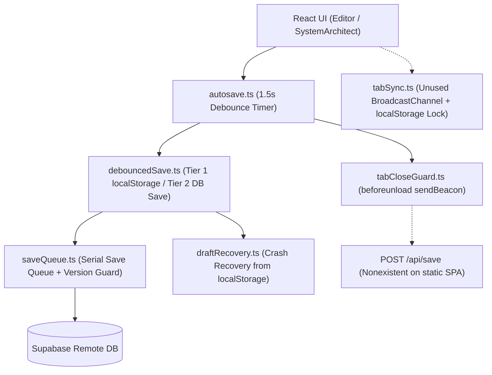
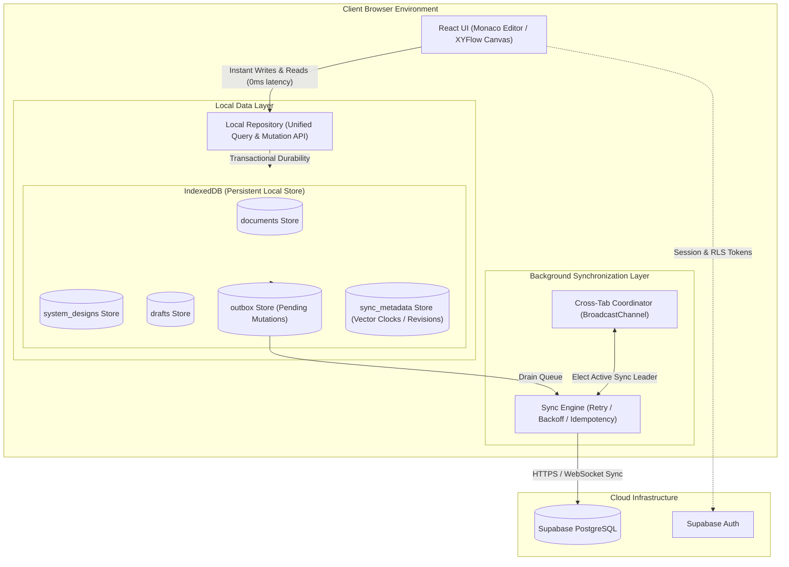

# Architectural Decision Record: Shift to Local-First / Offline-First Persistence

**Status:** Approved / Planned  
**Date:** September 2026  
**Deciders:** Core Engineering Team  
**Scope:** Document Editing, System Architecture Boards, Autosave, and Client-Server Synchronization  

---

## 1. Executive Summary

This document records the strategic decision to transition **Artix** from its legacy, network-dependent persistence model to a unified **Local-First / Offline-First** architecture powered by **IndexedDB**, the **Outbox Pattern**, and an asynchronous **Sync Engine** synchronizing with **Supabase**.

During our production hardening phase (Tasks §2.1–§2.3), our deep audits revealed that continuing to patch the legacy persistence stack would produce fragile, throwaway code. Rather than building temporary backend endpoints (such as a tab-close beacon handler) or wiring ad-hoc `localStorage` cross-tab locks, Artix will complete all architecture-independent hardening tasks on `main`, establish a rock-solid baseline, and execute the Local-First transition on a dedicated feature branch (`feat/offline-first-indexeddb`).

---

## 2. Context & Problem Analysis (The Legacy Architecture)

### 2.1 The Legacy "Multi-Headed" Persistence Stack

Artix previously evolved an ad-hoc combination of independent layers that all attempted to manage caching, drafts, and persistence simultaneously:



### 2.2 Root Architectural Deficiencies

1. **The Network as a Blocking Dependency:**
   - In the legacy model, a document write was only considered "saved" when an HTTP request successfully reached Supabase and returned a 200 OK.
   - Any transient network interruption, airplane mode, or high-latency connection degraded the user experience with UI spinners, stalled state, or failed saves.

2. **The "Tab-Close Dilemma" (The Flaw of Task §2.4):**
   - Because the network owned persistence, closing a tab while an edit was in-flight risked data loss.
   - The legacy codebase attempted to mitigate this by invoking `navigator.sendBeacon('/api/save')` inside `beforeunload`.
   - However, Artix is deployed as a static SPA on Vercel; `/api/save` was a non-existent endpoint returning a 404 HTML shell.
   - Pushing ahead with the legacy model would have required building, deploying, and maintaining a bespoke Supabase Edge Function to receive beacons, even though `sendBeacon` suffers from a 64 KB browser payload ceiling that breaks on complex architecture diagrams.

3. **Inherent Limitations of `localStorage`:**
   - Synchronous, blocking I/O on the browser's main thread (causing frame drops during large JSON stringification).
   - Strict ~5 MB browser quota, easily exhausted by complex architecture diagrams, drawings, and version history.
   - Storing full application data in `localStorage` created two competing sources of truth: the Supabase remote state vs. the local browser cache.

---

## 3. The Catalyst for the Decision

While hardening the system in Task §2.1 (encryption concurrency), Task §2.2 (save queue integration), and Task §2.3 (draft recovery on mount), we reached two critical decision gates:

- **Task §2.4:** Build an Edge Function for `tabCloseGuard` or strip the beacon?
- **Task §2.5:** Wire in the legacy `tabSync.ts` with fragile `localStorage` locks or remove it?

A rigorous architectural evaluation revealed:
> **Core Realization:** In a true Local-First architecture, the browser does not need to fire a desperate, last-second network beacon when closing a tab. The user's keystroke is already durably committed to local storage upon execution. The network is completely decoupled from the tab lifecycle.

Building temporary backend adapters to prop up the legacy autosave would be an anti-pattern: spending engineering bandwidth to polish an architecture that is scheduled for deprecation.

---

## 4. The Target Architecture: Local-First / Offline-First

### 4.1 Architectural Diagram



### 4.2 Core Components & Invariants

#### 1. React UI
- Interacts **exclusively** with the `Local Repository`.
- Zero network latency on keystrokes: UI state updates immediately upon local commit.
- Never blocked by network offline state or server throttling.

#### 2. Local Repository
- Exposes a strongly-typed, domain-driven interface for documents, boards, and drafts.
- Encapsulates queries and mutations behind async repository methods.
- Replaces direct `useQuery` / `useMutation` calls to Supabase with local-first observable queries (e.g. Dexie.js live queries or custom event emitters).

#### 3. IndexedDB Store
- Structured, asynchronous, transactional database in the browser capable of storing hundreds of megabytes.
- **Dedicated Object Stores:**
  - `documents`: Full document metadata, content, and format.
  - `system_designs`: Architecture nodes, edges, and canvas drawing strokes.
  - `outbox`: Serialized mutation events queued for cloud synchronization.
  - `sync_metadata`: Last synchronized timestamps, server revisions, and entity etags.

#### 4. The Outbox Pattern
- Every user modification creates an immutable entry in the `outbox` table within the same local IndexedDB transaction that updates the entity.
- Outbox record structure:
  ```ts
  interface OutboxMutation {
    id: string;              // UUID
    entityType: 'document' | 'design';
    entityId: string;
    operation: 'CREATE' | 'UPDATE' | 'DELETE';
    payload: Record<string, unknown>;
    createdAt: number;       // Client epoch timestamp
    baseVersion?: string;    // Optimistic concurrency token
    retryCount: number;
    status: 'pending' | 'in_flight' | 'failed';
  }
  ```
- Guarantees: If the browser tab crashes, powers down, or is closed, the outbox record persists. Upon next launch, the Sync Engine resumes draining the outbox.

#### 5. The Sync Engine
- Runs as an unblocking background worker process.
- **Responsibilities:**
  - Monitors network connectivity (`navigator.onLine`, window `online`/`offline` events).
  - Drains outbox mutations in strict chronological order.
  - Enforces exponential backoff with jitter on network or 5xx server errors.
  - Sends idempotent mutation headers to prevent duplicate processing on retries.
  - Detects server version conflicts (`updated_at` mismatches) and triggers deterministic resolution (e.g. 3-way merge or user-prompted resolution).

#### 6. Cross-Tab Coordination
- Coordinates multiple open tabs via `BroadcastChannel`.
- Uses lightweight leader election so only **one** tab actively drains the outbox to Supabase, eliminating redundant network traffic and write-lock conflicts.
- Broadcasts local IndexedDB mutation events across tabs so inactive tabs immediately reflect changes made in the active tab without needing network round-trips.

---

## 5. Storage Tiering & Segregation

To maintain clean architecture and prevent storage bloat, Artix strictly segregates storage responsibilities:

| Storage Medium | Allocated Responsibilities | What Must NOT Be Stored Here |
|:---|:---|:---|
| **IndexedDB** | - Document contents & metadata<br>- Architecture boards, nodes, edges & strokes<br>- Outbox mutation queue<br>- Sync metadata & version vectors<br>- Large binary assets / diagram snapshots | - Session JWTs (handled by Supabase client)<br>- Ephemeral UI toggle flags |
| **`localStorage`** | - Dark/light theme preference<br>- Sidebar collapsed state<br>- Dismissed banner/modal flags<br>- Supabase Auth session token (default SDK location) | - Document contents & markdown text<br>- System design board states<br>- Unsaved drafts<br>- Outbox queue |
| **RAM (`memoryCache`)** | - Decrypted AI settings & decrypted API keys (zero-knowledge vault)<br>- Ephemeral form inputs | - Persistent document data without an IndexedDB backing record |

---

## 6. Preservation of Prior Hardening Work

The shift to a Local-First architecture **does not invalidate** the rigorous hardening milestones completed to date. Rather, our recent hardening work serves as the direct foundational prototype for the new architecture:

1. **`saveQueue.ts` (Task §2.2):**
   - Proved the requirements for serial write ordering, queue draining, and version-guarded optimistic concurrency.
   - Its core algorithms will be absorbed directly into the `Sync Engine`'s outbox processor.

2. **`draftRecovery.ts` (Task §2.3):**
   - Proved the absolute necessity of crash resilience and silent recovery.
   - In the new architecture, this concept matures from an ad-hoc `localStorage` key check into a native query against IndexedDB's `outbox` and `documents` stores.

3. **AI Settings Concurrency Hardening (Task §2.1b):**
   - Successfully eliminated cryptographic vault corruption and race conditions in `src/lib/ai/storage.ts` using FIFO queueing and state epoch invalidation.
   - AI provider keys remain an encrypted, zero-knowledge subsystem in `localStorage`/RAM and are completely unaffected by the document persistence redesign.

---

## 7. Task Triage: Current Hardening vs. Deferred Tasks

Based on the decision principle: *"Will this change still be correct and useful after moving to Local-First?"*, the remaining tasks from the original plan are triaged as follows:

```
                               ┌───────────────────────────────────────────────────────────┐
                               │                 Remaining Hardening Tasks                 │
                               └─────────────────────────────┬─────────────────────────────┘
                                                             │
                             ┌───────────────────────────────┴───────────────────────────────┐
                             ▼                                                               ▼
             ┌───────────────────────────────┐                               ┌───────────────────────────────┐
             │      Finish NOW on main       │                               │     DEFER to Local-First      │
             │   (Architecture-Independent)  │                               │      (Persistence-Bound)      │
             └───────────────┬───────────────┘                               └───────────────┬───────────────┘
                             │                                                               │
      ┌──────────────────────┴──────────────────────┐                 ┌──────────────────────┴──────────────────────┐
      ▼                                             ▼                 ▼                                             ▼
[§2.6: React Error Boundary]              [§3.4: Repo Cleanup]  [§2.4: tabCloseGuard / Beacon]   [§2.5: Cross-Tab Sync]
- Top-level render protection             - Package metadata    - Obsoleted by outbox            - Obsoleted by IDB engine
- Safe user recovery screen               - Broken links        - No Edge Function needed        - Redesigned in sync layer
- Zero persistence coupling               - Canonical lockfile
```

### Detailed Triage Breakdown

| Task ID | Name | Classification | Action / Rationale |
|:---|:---|:---|:---|
| **§2.1b** | Encryption Concurrency | **Completed** | Finished, tested, and verified on CI (Commit `caec894`). |
| **§2.6** | React Error Boundary | **Execute Now** | Independent of persistence. Protects users from blank render screens. |
| **§3.4** | Repository Cleanup | **Execute Now** | Independent repository hygiene and link validation. |
| **§2.4** | `tabCloseGuard` Beacon | **Deferred** | Do not build a throwaway Edge Function. Outbox in IndexedDB replaces this. |
| **§2.5** | Cross-Tab Sync | **Deferred** | Do not wire legacy `tabSync.ts`. Cross-tab sync will be native to the Sync Engine. |
| **§2.7** | `localStorage` Migration | **Deferred** | Do not do a partial migration. Application data moves directly to IndexedDB in Phase 2. |
| **§2.8** | Usage Dashboard | **Re-evaluate** | Product/design decision regarding token metrics; does not block architecture. |
| **§3.1** | Zod Validation | **Re-evaluate** | Revisit on the new boundary shapes (IndexedDB entities & Outbox records). |
| **§3.2** | TypeScript Strictness | **Re-evaluate** | Targeted fixes only; avoid heavy type churn immediately before rewriting persistence. |
| **§3.3** | Error Surfacing | **Re-evaluate** | Structure error reporting around Local Write / Outbox / Sync failure boundaries. |

---

## 8. Implementation Roadmap

### Phase 1: Baseline Stabilization (Current Branch: `main`)
- [x] Complete Task §2.1b (Encryption-State Concurrency Hardening).
- [x] Complete Task §2.2 (SaveQueue & Optimistic Locking).
- [x] Complete Task §2.3 (Draft Recovery on Mount).
- [ ] Implement Task §2.6 (React Top-Level ErrorBoundary & Recovery UI).
- [ ] Implement Task §3.4 (Repository, Link & Metadata Cleanup).
- [ ] Verify full test suite, lint, typecheck, and production build on GitHub Actions CI.

### Phase 2: The Local-First Branch (`feat/offline-first-indexeddb`)
1. **Foundation:**
   - Establish Dexie.js (or native `idb`) IndexedDB schema: `documents`, `system_designs`, `outbox`, `sync_metadata`.
   - Build migration utilities to safely import existing `localStorage` drafts and Supabase cached records.
2. **Local Repository Layer:**
   - Implement `DocumentRepository` and `DesignRepository`.
   - Wire optimistic local updates with immediate outbox entry creation.
3. **Sync Engine:**
   - Implement offline detection, exponential backoff, and outbox draining worker.
   - Connect to Supabase REST / Realtime endpoints.
   - Implement conflict detection using `updated_at` exact-match tokens.
4. **Cross-Tab & Lifecycle:**
   - Implement `BroadcastChannel` coordination for multi-tab sync without server polling.
   - Remove legacy `tabCloseGuard.ts`, `tabSync.ts`, and legacy `debouncedSave.ts` paths.
5. **Testing & Validation:**
   - Simulated offline editing, hard process terminations (tab kills), outbox resumption on restart, and multi-tab concurrence.

### Phase 3: Cutover & Release
- Comprehensive end-to-end regression testing.
- Merge `feat/offline-first-indexeddb` into `main`.
- Update user documentation showcasing full offline capabilities.

---

## 9. Conclusion

The transition to a Local-First architecture elevates Artix from a standard cloud-reliant web application into a resilient, high-performance professional engineering platform. By stabilizing our architecture-independent baseline first, we avoid technical debt and set the stage for a clean, deterministic, and world-class persistence redesign.
