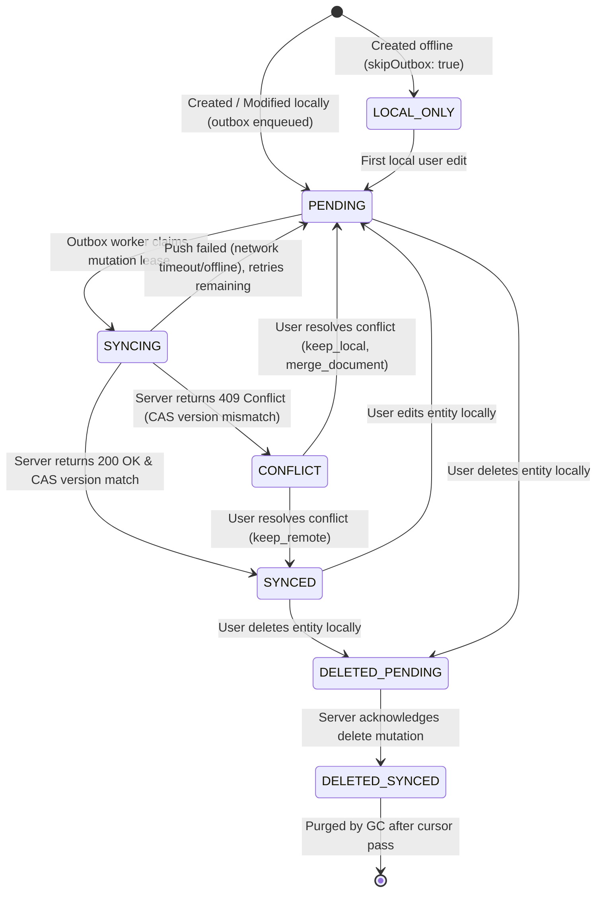
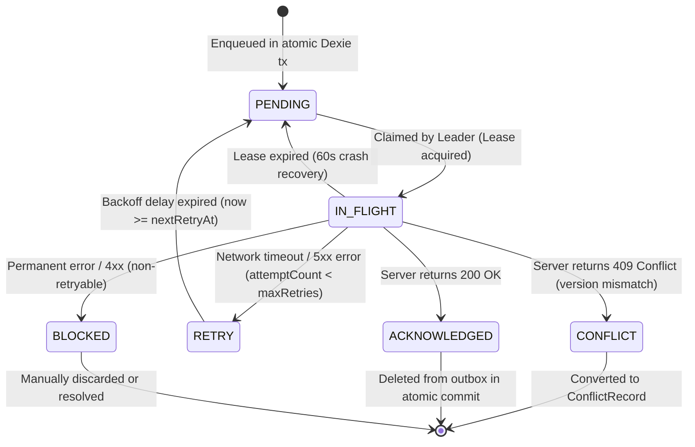
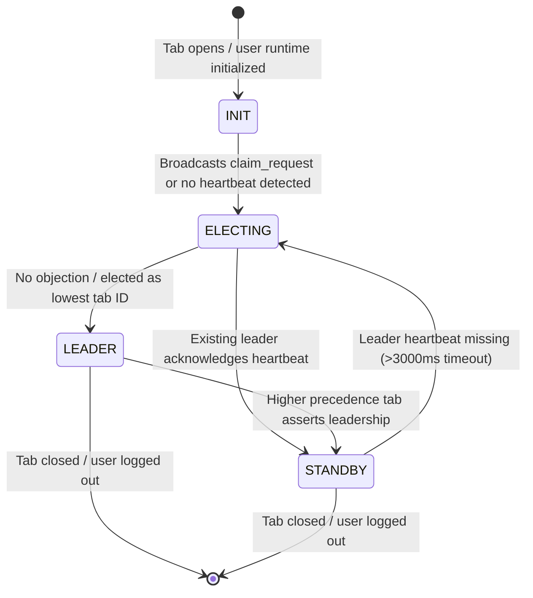

# Artix Synchronization State Machine Specification

## 1. Overview
This document defines the formal finite state machines (FSMs) governing synchronization in Artix:
1. **Local Entity Synchronization State Machine**
2. **Outbox Entry Mutation Lifecycle State Machine**
3. **Multi-Tab Coordinator Leadership State Machine**
4. **Outbox Compaction Transition Matrix**

---

## 2. Local Entity Synchronization State Machine

### State Definitions:
- **`LOCAL_ONLY`**: Ephemeral or locally seeded entity without cloud replication intent.
- **`PENDING`**: Modified locally; outbox mutation queued; awaiting background drain.
- **`SYNCING`**: Push mutation currently claimed by leader tab under active lease.
- **`SYNCED`**: Local state is identical to acknowledged server state; no pending outbox entries.
- **`CONFLICT`**: Concurrent modification detected; mutation blocked until user or diff3 strategy resolves.
- **`BLOCKED`**: Mutation rejected due to permanent non-retryable error (e.g. schema/validation or permission error).
- **`DELETED_PENDING`**: Marked soft-deleted locally; outbox `delete` operation queued.
- **`DELETED_SYNCED`**: Deletion confirmed by server; retained as tombstone for cursor hydration.

---

## 3. Outbox Entry Mutation Lifecycle State Machine

### State Definitions:
- **`PENDING`**: Ready to be claimed by the active leader tab.
- **`IN_FLIGHT`**: Assigned `leaseOwner: tabId` and `leaseExpiresAt: now + 60s`.
- **`ACKNOWLEDGED`**: Successfully applied and recorded on server; ready for atomic removal.
- **`RETRY`**: Transient error encountered; scheduled for next attempt with exponential backoff:
  $$\text{backoffMs} = \min(30000, 1000 \times 2^{\text{attemptCount} - 1}) + \text{jitter}$$
- **`CONFLICT`**: Version precondition failed; stored in `conflicts` repository.
- **`BLOCKED`**: Exceeded max retries (5) or encountered non-retryable 4xx authorization failure.

---

## 4. Multi-Tab Coordinator Leadership State Machine

### Invariants:
1. **Single Drain Owner**: Exactly one tab acts as `LEADER` per active user session.
2. **Crash Failover**: If the leader crashes, standby tabs detect heartbeat silence within 3000ms and elect a new leader.
3. **Lease Protection**: A standby becoming leader runs `recoverStaleLeases()` to reclaim in-flight mutations left by the crashed leader.
4. **Reactive Notifications**: The leader tab broadcasts entity modification events to standby tabs via `BroadcastChannel` with 3000ms duplicate signature deduplication.

---

## 5. Outbox Compaction Transition Matrix

When a new mutation is enqueued while an existing mutation for the same `(userId, entityType, entityId)` is already `PENDING` in the outbox:

| Existing Pending Operation | Incoming Operation | Compacted Operation | Payload Resolution | Revision Handling |
|:---:|:---:|:---:|:---|:---|
| **`create`** | **`update`** | **`create`** | Merge updates into create payload | $\max(\text{rev}_{\text{exist}}, \text{rev}_{\text{new}})$ |
| **`create`** | **`delete`** | *None (Cancel)* | Remove pending outbox entry completely (entity was born and died offline) | Deleted from outbox |
| **`update`** | **`update`** | **`update`** | Merge new patch fields over previous patch | $\max(\text{rev}_{\text{exist}}, \text{rev}_{\text{new}})$ |
| **`update`** | **`delete`** | **`delete`** | Convert to delete operation; payload discarded | $\max(\text{rev}_{\text{exist}}, \text{rev}_{\text{new}})$ |
| **`delete`** | **`create` / `restore`** | **`update`** | Re-activates entity with new desired state | $\max(\text{rev}_{\text{exist}}, \text{rev}_{\text{new}})$ |
| **`delete`** | **`delete`** | **`delete`** | Redundant no-op; keep existing delete | No change |

> [!NOTE]
> Compaction applies **only** to outbox entries in `'pending'` state. Entries currently `'in_flight'` under an active lease are never mutated in-place to avoid race conditions with network transport.
