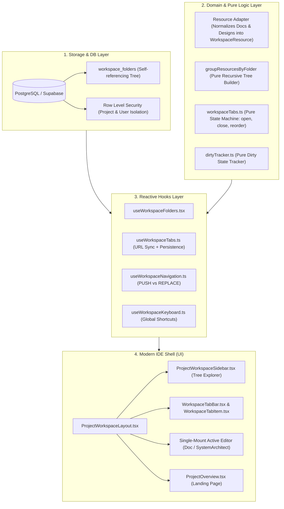

# 🎯 الدليل الهندسي الشامل لاجتياز المقابلات التقنية: معمارية Artix Workspace
### (PR #1: Unified Shell, Hierarchical Folders & Desktop-Grade Multi-Tab Subsystem)

---

## 📌 الفهرس
1. [المقدمة والعرض التعريفي السريع (The 60-Second Elevator Pitch)](#1-المقدمة-والعرض-التعريفي-السريع-the-60-second-elevator-pitch)
2. [المشكلة قبل التحديث والدافع المعماري (The Problem & Motivation)](#2-المشكلة-قبل-التحديث-والدافع-المعماري-the-problem--motivation)
3. [الركائز المعمارية الأساسية للحل (Core Architectural Pillars)](#3-الركائز-المعمارية-الأساسية-للحل-core-architectural-pillars)
   - [الركيزة الأولى: قاعدة البيانات وشجرة المجلدات الهرمية (Hierarchical Tree)](#-الركيزة-الأولى-قاعدة-البيانات-وشجرة-المجلدات-الهرمية)
   - [الركيزة الثانية: نمط المحول وتوحيد الموارد (The Adapter Pattern)](#-الركيزة-الثانية-نمط-المحول-وتوحيد-الموارد-the-adapter-pattern)
   - [الركيزة الثالثة: نظام التبويبات المتعددة (Desktop-Grade Tabs Subsystem)](#-الركيزة-الثالثة-نظام-التبويبات-المتعددة-desktop-grade-tabs)
   - [الركيزة الرابعة: حماية التعديلات غير المحفوظة (Dirty Tracking & Close Protection)](#-الركيزة-الرابعة-حماية-التعديلات-غير-المحفوظة-dirty-state-protection)
   - [الركيزة الخامسة: تزامن الحالة الثلاثي (Tripartite State Synchronization)](#-الركيزة-الخامسة-تزامن-الحالة-الثلاثي-tripartite-state-sync)
4. [أصعب التحديات التقنية وكيف تم حلها (Deep Technical Challenges & Solutions)](#4-أصعب-التحديات-التقنية-وكيف-تم-حلها)
5. [منظومة الجودة والاختبارات الآلية (Quality Assurance & CI/CD Pipeline)](#5-منظومة-الجودة-والاختبارات-الآلية)
6. [أهم 10 أسئلة وإجابات نموذجية للمقابلات التقنية (Top 10 Senior Interview Q&A)](#6-أهم-10-أسئلة-وإجابات-نموذجية-للمقابلات-التقنية-top-10-senior-interview-qa)

---

## 1. المقدمة والعرض التعريفي السريع (The 60-Second Elevator Pitch)

> **سؤال الإنترفيو المعتاد:** *"احكي لي عن آخر مشروع أو ميزة معمارية قوية قمت ببنائها؟"*

### الإجابة النموذجية المباشرة:
> "في مشروعي الأخير **Artix** (وهو منصة هندسية لتصميم الأنظمة وكتابة الوثائق التقنية)، قمت بقيادة وتطوير تحول معماري شامل لبيئة العمل (**Workspace**) من واجهة ويب تقليدية مجزأة إلى **Desktop-Grade IDE** مستوحى من أدوات مثل VS Code و Obsidian.
> 
> التعديل تضمن **26 Commit منظم و 54 ملفاً (+7086 سطر كود)** ركزت على ركيزتين أساسيتين:
> 1. **نظام هرمي مرن للمجلدات (Hierarchical Folder System):** مبني على شجرة تكرارية (Self-Referencing Tree) في PostgreSQL مع سياسات حماية Row Level Security (RLS)، ونظام متقدم لمنع تكرار الأسماء بالـ Auto-Increment.
> 2. **نظام تبويبات هندسي فائق الأداء (Multi-Tab Subsystem):** يدعم فتح ملفات متعددة مع الحفاظ على الأداء بأسلوب (Single-Mount Active Editor)، تتبع التعديلات غير المحفوظة (Two-Tier Dirty Tracking)، التراجع وتاريخ المتصفح الدقيق، واختصارات لوحة المفاتيح الكاملة مثل `Ctrl+W` و `Ctrl+Tab`.
> 
> كل ذلك تم تسليمه بـ **329 فحص آلي ناجح بنسبة 100%**، مع zero regressions وبناء إنتاج فائق السرعة."

---

## 2. المشكلة قبل التحديث والدافع المعماري (The Problem & Motivation)

قبل هذا التحديث، كانت منصة Artix تعاني من تحديات في تجربة المستخدم والهيكلة:
1. **تشتت الموارد (Fragmented Resource View):** كانت الوثائق (`documents`) وتصميمات الأنظمة (`system_designs`) تعيش في واجهات منفصلة أو قوائم مسطحة (Flat Lists)، بدون أي تسلسل هرمي أو إمكانية تنظيم الملفات داخل مجلدات.
2. **عدم وجود نظام تبويبات (No Multi-Document Workflow):** كان المهندس مجبراً على الانتقال بين الصفحات كاملة وإعادة تحميلها إذا أراد الاطلاع على وثيقة أثناء رسم System Architecture، مما يفقده تركيزه وتراكم كاش غير منظم.
3. **تكرار منطق التعامل مع البيانات (Violating DRY):** كان كود عرض الوثيقة يختلف تماماً عن كود عرض التصميم المعماري بالرغم من تشابه العمليات (Rename, Move, Delete, Drag & Drop).

---

## 3. الركائز المعمارية الأساسية للحل (Core Architectural Pillars)



---

### 📂 الركيزة الأولى: قاعدة البيانات وشجرة المجلدات الهرمية
* **الجدول:** تم إنشاء جدول `workspace_folders` بأسلوب **Adjacency List Model**:
  ```sql
  CREATE TABLE public.workspace_folders (
      id UUID PRIMARY KEY DEFAULT gen_random_uuid(),
      project_id UUID NOT NULL REFERENCES public.projects(id) ON DELETE CASCADE,
      name TEXT NOT NULL,
      parent_folder_id UUID REFERENCES public.workspace_folders(id) ON DELETE CASCADE,
      user_id UUID NOT NULL,
      created_at TIMESTAMPTZ DEFAULT now(),
      updated_at TIMESTAMPTZ DEFAULT now()
  );
  ```
* **حماية البيانات (Security & Isolation):**
  - تفعيل **RLS (Row Level Security)** بالكامل لعزل بيانات المستخدم والمشروع بحيث لا يمكن لأي مستخدم استعلام أو تعديل مجلدات مستخدم آخر.
* **سياسة الحذف الذكي (No Orphan Cascades):**
  - في جداول `documents` و `system_designs`، تم وضع `folder_id REFERENCES workspace_folders(id) ON DELETE SET NULL`.
  - **السبب المعماري:** إذا قام المستخدم بحذف مجلد يحتوي على وثائق وتصميمات هامة، لا نريد حذف الوثائق تلقائياً (تجنباً للكارثة)، بل تعود تلقائياً للـ Root Directory لتظل محفوظة.

---

### 🔄 الركيزة الثانية: نمط المحول وتوحيد الموارد (The Adapter Pattern)
* **المشكلة:** الوثائق لها خصائص معينة (`title`, `content`) والتصميمات لها خصائص أخرى (`title`, `canvas_data`).
* **الحل المعماري:** تصميم واجهة موحدة `WorkspaceResource`:
  ```typescript
  export type WorkspaceResourceType = 'document' | 'system_design';

  export interface WorkspaceResource {
      id: string;
      type: WorkspaceResourceType;
      name: string;
      folderId: string | null;
      updatedAt: string;
      createdAt: string;
      projectId: string;
  }
  ```
* **الفائدة في المقابلة:** تطبيق مباشر لمبدأ **Single Responsibility** و **Dependency Inversion**؛ كل مكونات الـ Sidebar، القوائم المنبثقة، البحث، والسحب والإفلات (Drag & Drop) أصبحت تتعامل مع نوع موحد `WorkspaceResource` عبر محول نقي `resourceAdapter.ts` دون الحاجة لمعرفة تفاصيل الجداول المنفصلة.
* **خوارزمية منع تكرار الأسماء (Smart Auto-Increment):**
  - تم بناء دالة فحص نطاق المجلد (`validateResourceName` و `generateUniqueName`).
  - إذا وجد اسم "Architecture" في نفس المجلد، يقوم النظام تلقائياً بإنشاء "Architecture 1" ثم "Architecture 2" بشكل ذكي وبمقارنة غير حساسة لحالة الأحرف (Case-Insensitive).

---

### 📑 الركيزة الثالثة: نظام التبويبات المتعددة (Desktop-Grade Tabs Subsystem)

#### 1. الفصل الصارم بين منطق النطاق (Domain Logic) وإطار React:
* تم كتابة `workspaceTabs.ts` كـ **دوال نقية (Pure Functions) بنسبة 100%**:
  - `openTab(state, resource)`
  - `closeTab(state, tabId)`
  - `reorderTabs(state, fromIndex, toIndex)`
  - `closeOtherTabs(state, tabId)`
* **الميزة الهندسية:** لا توجد أي تأثيرات جانبية (Side Effects)، ويمكن اختبار 100 حالة تشغيل دون الحاجة لـ Mocking لمكونات React أو الـ DOM.

#### 2. حل معضلة الأداء: (Single-Mount vs Multi-Mount):
* **السؤال الكلاسيكي:** *لماذا لم نقم بعمل Mount لجميع المحررات في وقت واحد داخل `display: none`؟*
* **القرار المعماري:** لو كان لدى المستخدم 15 تبويب مفتوح (محرر Monaco للوثائق ومحرر رسومي Canvas للأنظمة المعمارية)، فإن عمل Multi-Mount سيتسبب في استهلاك هائل للذاكرة (Memory Bloat) وبطء في الـ Frame Rate (Dropping FPS) بسبب الـ Canvas Contexts ومراقبي الأحداث.
* **الحل المطبق:** محرر نشط واحد فقط في الـ DOM (**Single-Mount Active Editor**)، وتبديل البيانات فائق السرعة عبر الـ Props، مع الحفاظ على الـ Dirty State في ذاكرة خفيفة.

---

### 🛡️ الركيزة الرابعة: حماية التعديلات غير المحفوظة (Dirty State Protection)
* **مؤشر التعديل (Dirty Indicator):** يظهر رمز النقطة (`●`) بجانب اسم الملف في التبويب فور كتابة المستخدم لأي حرف غير محفوظ.
* **حوار التأكيد عند الإغلاق (CloseTabConfirmDialog):**
  - عند محاولة إغلاق تبويب يحتوي على تعديلات غير محفوظة، يعترض النظام الحدث فوراً ويظهر نافذة تأكيد احترافية تتيح للمستخدم:
    1. **Save & Close:** حفظ التعديلات فوراً ثم إغلاق التبويب.
    2. **Discard:** تجاهل التعديلات وإغلاقه فوراً.
    3. **Cancel:** التراجع والبقاء داخل التبويب.
* **الـ Tab Bar Middle-Click:** دعم إغلاق التبويب بالنقر بزر الفأرة الأوسط (Scroll Wheel Click) مثل المتصفحات و VS Code مع تمرير الحماية من الإغلاق غير المقصود.

---

### 🔗 الركيزة الخامسة: تزامن الحالة الثلاثي (Tripartite State Synchronization)
أحد أقوى جوانب المعمارية هو التزامن الدقيق بين ثلاثة مصادر:
1. **URL Parameters (`?doc=...` / `?design=...`):** مصدر الحقيقة المباشر لمشاركة الروابط وإعادة التحميل (Deep Linking).
2. **Browser LocalStorage (`artix.workspace.tabs.${projectId}`):** استرجاع جميع التبويبات المفتوحة وترتيبها عند إغلاق المتصفح والعودة لاحقاً.
3. **React State (`activeTabId`, `tabs`):** سرعة الاستجابة اللحظية داخل الواجهة (60 FPS UI).

* **دقة تاريخ المتصفح (Browser History Semantics):**
  - **فتح ملف جديد:** يستخدم دالة `openDocument` التي تنفذ `navigate` بدلالة `PUSH`، بحيث إذا ضغط المستخدم على زر Back في المتصفح، يعود للوثيقة السابقة بسلاسة.
  - **الانتقال لصفحة الـ Overview:** يستخدم `history.replace` لعدم تلويث تاريخ المتصفح، مع إبقاء التبويبات مفتوحة في الشريط كحالة (No Active Tab).

---

## 4. أصعب التحديات التقنية وكيف تم حلها

### التحدي 1: حلقة إعادة التصيير اللانهائية بين الرابط وشريط التبويبات (URL-Tabs Infinite Loop)
* **المشكلة:** تحديث الرابط يؤدي لتحديث التبويب النشط، وتحديث التبويب النشط يطلب تحديث الرابط، مما كان يهدد بحدوث Infinite Re-renders في React.
* **الحل:** بناء آلية مقارنة ذكية (**State-Diffing Guard**) في `useWorkspaceTabs` تمنع كتابة الرابط إذا كان الرابط الحالي يطابق بالفعل التبويب المطلوب، مع عزل استدعاءات `navigate` داخل `useEffect` دقيق المراجع (Dependency Array Hygiene).

### التحدي 2: تجاوز سعة الـ LocalStorage وفساد البيانات (Corrupted Storage & QuotaExceeded)
* **المشكلة:** قد تفشل عملية الحفظ في المتصفح إذا كانت المساحة ممتلئة أو إذا تم إدخال JSON غير سليم يدوياً من أدوات المطورين.
* **الحل:** إنشاء محول صلب `tabPersistence.ts` مغلف بـ `try/catch` ذكي، يتعامل بهدوء مع `QuotaExceededError` ويحتوي على Fallback تلقائي للقيم الافتراضية في حال وجود بيانات فاسدة دون أن تنهار شاشة التطبيق بيضاء (No White Screens).

### التحدي 3: اعتراض اختصارات لوحة المفاتيح دون كسر الكتابة (Global Keyboard Trapping)
* **المشكلة:** عند الضغط على `Ctrl+W` أو اختصارات الأرقام، كان يمكن أن يتداخل الاختصار مع كتابة المستخدم العادية داخل حقول النصوص أو داخل محرر الكود.
* **الحل:** في `useWorkspaceKeyboard.ts`، تم وضع فحص صريح للمصدر:
  ```typescript
  const target = event.target as HTMLElement;
  const isInput = target.tagName === 'INPUT' || target.tagName === 'TEXTAREA' || target.isContentEditable;
  // منع الاختصارات العامة من التدخل أثناء الكتابة إلا للاختصارات المقصودة صراحة كـ Tab Switching
  ```

---

## 5. منظومة الجودة والاختبارات الآلية

| المقياس | النتيجة | الأهمية في المقابلة التقنية |
| :--- | :---: | :--- |
| **عدد الفحوصات الآلية (Automated Tests)** | **329 فحص ناجح** | تغطية شاملة لجميع المسارات الحرجة وحالات الحافة. |
| **ملفات الاختبارات (Test Suites)** | **41 ملف** | تنظيم معماري دقيق (Unit, Integration, Shell Tests). |
| **أخطاء الـ TypeScript (`tsc`)** | **0 أخطاء** | Type-Safety صارم بدون استخدام أي تجاوزات غير آمنة (`any`). |
| **أخطاء الـ Linting (ESLint)** | **0 أخطاء** | كود قياسي يتبع أفضل ممارسات النظافة البرمجية. |
| **وقت بناء الإنتاج (Production Build)** | **9.23 ثانية** | تجميع فائق السرعة عبر Vite مع دعم كامل للـ PWA. |
| **فحوصات الـ CI/CD (GitHub Actions)** | **7/7 Passed ✅** | فحص تلقائي لكل Pull Request قبل الدمج في `main`. |

---

## 6. أهم 10 أسئلة وإجابات نموذجية للمقابلات التقنية (Top 10 Senior Interview Q&A)

### س1: لماذا قررت بناء نظام التبويبات كدوال نقية (Pure Functions) داخل ملف مستقل، بدلاً من وضع المنطق كله داخل React Hook؟
**الإجابة:**  
"اتباعاً لمبدأ **Separation of Concerns**. منطق التبويبات (الفتح، الإغلاق، إعادة الترتيب، الحسابات الرياضية للمؤشر النشط) هو **منطق نطاق نقي (Pure Business Logic)** لا يعتمد على الـ DOM أو React Lifecycle.  
بفصله كدوال نقية:
1. استطعنا كتابة **32 فحص آلي في أقل من 30 ملي ثانية** بدون أي overhead لـ React Test Library أو JSDOM.
2. الكود أصبح قابلاً للاستخدام في أي إطار عمل آخر مستقبلاً.
3. الـ React Hook (`useWorkspaceTabs`) أصبح دوره فقط هو ربط هذا المنطق النقي بـ React State والـ Side Effects (مثل الـ URL و LocalStorage)."

---

### س2: كيف تم التعامل مع إدارة الأداء عند فتح ملفات كثيرة في نفس الوقت؟
**الإجابة:**  
"رفضنا أسلوب **Multi-Mount** (أي تحميل جميع المحررات في الـ DOM وإخفاؤها بـ `display: none`)؛ لأن محرر الوثائق ومحرر الأنظمة المعمارية يستهلكان Canvas و WebGL و Memory Contexts ضخمة.  
بدلاً من ذلك، طبقنا نمط **Single-Mount Active Viewport**؛ حيث يتم تحميل محرر واحد نشط فقط في شجرة الـ DOM، ويتم تبديل البيانات الخاصة بالملف النشط عبر الـ Props، مع الاحتفاظ بحالة التعديلات الخفيفة (Dirty State) في كائن في الذاكرة. هذا يضمن بقاء معدل الإطارات عند **60 FPS** حتى لو فتح المستخدم 50 تبويباً."

---

### س3: كيف بنيتم شجرة المجلدات في قاعدة البيانات؟ وما هي الميزات والعيوب مقارنة بالبدائل؟
**الإجابة:**  
"استخدمنا نموذج **Adjacency List** حيث يحتوي كل مجلد على `parent_folder_id` يشير لنفس الجدول (`self-referencing foreign key`).  
* **الميزة:** بساطة عمليات الـ Insertion والـ Move (تغيير المجلد الأب لا يتطلب سوى تحديث عمود واحد `O(1)` بعكس Path Enumeration أو Nested Sets).  
* **معالجة العيوب في الـ Client:** قمنا ببناء دالة نقية `groupResourcesByFolder.ts` تقوم بتحويل القائمة المسطحة القادمة من الـ API إلى شجرة تكرارية (Recursive Tree) في مسار زمني خطي `O(N)` مع حماية ضد الحلقات الدائرية (Cycle Detection)."

---

### س4: لماذا اخترتم `ON DELETE SET NULL` لعلاقة الوثائق بالمجلد بدلاً من `CASCADE`؟
**الإجابة:**  
"هذا قرار أمان بيانات (**Defensive Data Architecture**). في تطبيقات الإنتاج، لو قام المستخدم بحذف مجلد بالخطأ، وكان الإعداد `CASCADE`، فسيتم مسح كل الوثائق والتصميمات التي استغرق أسابيع في بنائها.  
باستخدام `ON DELETE SET NULL`: إذا حُذف المجلد، يتم فك ارتباط الملفات به تلقائياً وتتحول إلى ملفات في الجذر (Root Level)، مما يمنع فقدان البيانات تماماً."

---

### س5: كيف تعمل دورة حياة تتبع التعديلات (Dirty State Tracking) وحماية التبويب؟
**الإجابة:**  
"لدينا نظام تتبع ثنائي المراحل (**Two-Tier Dirty Tracking**):
1. **Tier 1 (مؤشر التبويب):** عندما يكتب المستخدم حرفاً، يتم إخطار `dirtyTracker`، فيظهر مؤشر (●) في التبويب دون تشغيل إعادة تصيير للواجهة كاملة.
2. **Tier 2 (حارس الإغلاق):** عندما يضغط المستخدم على زر الإغلاق (✖) أو `Ctrl+W`، تستعلم الدالة عن حالة التبويب عبر `dirtyTracker.isDirty(tabId)`. إذا كان التبويب معدلاً، يتم تعليق عملية الإغلاق وفتح `CloseTabConfirmDialog` لإعطاء المستخدم الخيار بين الحفظ أو الإهمال أو الإلغاء."

---

### س6: كيف تعاملتم مع مزامنة الـ URL بحيث يدعم الـ Deep Linking ولا يسبب مشاكل في زر الـ Back؟
**الإجابة:**  
"فصلنا بوضوح بين دلالات المتصفح:
* **فتح مورد جديد:** يستخدم دالة `openDocument` التي تنفذ `navigate` بدلالة `PUSH`، بحيث إذا ضغط المستخدم على زر Back في المتصفح، يعود للوثيقة السابقة بسلاسة.
* **إغلاق التبويب النشط أو التبديل:** يتم تحديث الرابط بـ `REPLACE` لتجنب حبس المستخدم في تاريخ طويل من مجرد النقر بين التبويبات المفتوحة بالفعل.
* **صفحة الـ Overview:** تعتبر حالة 'No Active Tab'، وعند الضغط عليها يفرغ الرابط من باراميتر الوثيقة ليظهر الـ Overview Landing Page مع بقاء التبويبات محفوظة في الشريط."

---

### س7: كيف منعتم تعارض أسماء الملفات داخل المجلدات؟
**الإجابة:**  
"طبقنا استراتيجية تحقق من خطوتين:
1. **Uniqueness Validation:** مقارنة الاسم المدخل بكافة أسماء الموارد في نفس المجلد بعد تطبيق `trim()` و `toLowerCase()`.
2. **Smart Auto-Increment:** عند إنشاء وثيقة جديدة بدون اسم، يفحص النظام المجلد: إذا وجد 'Untitled Document'، يقترح تلقائياً 'Untitled Document 1'، ثم 'Untitled Document 2'، مما يمنع حدوث أخطاء قاعدة البيانات قبل إرسال الطلب."

---

### س8: ما هو نمط التصميم (Design Pattern) الأبرز الذي استخدمته في توحيد واجهات الوثائق والتصميمات؟
**الإجابة:**  
"استخدمت **Adapter Pattern** عبر مكتبة `resourceAdapter.ts`. قاعدة البيانات لديها جدولان منفصلان تماماً (`documents` و `system_designs`) بخصائص مختلفة.  
المحول يأخذ الكائنات من كلا الجدولين ويخرج كائناً موحداً `WorkspaceResource`. وبفضل هذا النمط، فإن أكثر من 12 مكوناً في الواجهة (شريط التصفح، شريط البحث، شريط التبويبات، حوارات النقل وإعادة التسمية) تتعامل مع كود موحد دون أي تكرار أو فروع شرطية معقدة (`if document / else design`)."

---

### س9: كيف تضمنون عدم كسر اختصارات لوحة المفاتيح داخل التطبيق؟
**الإجابة:**  
"بنينا مخصصاً خطافياً `useWorkspaceKeyboard.ts` يستمع لأحداث `keydown`.  
الحماية الأولى هي فحص `event.target`: إذا كان الحدث قادماً من `input` أو `textarea` أو عنصر `contentEditable`، نتجاهل فوراً اختصارات الأرقام والتنقل حتى لا نحرم المستخدم من الكتابة الطبيعية.  
كما تم دعم اختصارات المنصات المختلفة (`e.ctrlKey || e.metaKey`) لتعمل بنفس الكفاءة على Windows و macOS."

---

### س10: ما هي الخطوة المعمارية التالية بعد دمج هذا الـ PR، ولماذا؟
**الإجابة:**  
"الخطوة التالية هي **التحول إلى معمارية Local-First / Offline Engine**.  
التبويبات وحفظ المسودات حالياً يعتمد جزئياً على `localStorage`، والـ Persistence الحقيقي يتطلب اتصالاً بشبكة الإنترنت مع Supabase.  
في بيئات الإنتاج المتقدمة، يجب أن يعمل محرر الوثائق والأنظمة المعمارية حتى لو انقطعت الشبكة تماماً (Offline-First). لذا سنستبدل الاعتماد على الشبكة بـ **IndexedDB** مع **Outbox Pattern** ومحرك مزامنة خلفي (**Background Sync Engine**) يضمن عدم فقدان أي بايت من البيانات مهما حدث للمتصفح أو الاتصال."
