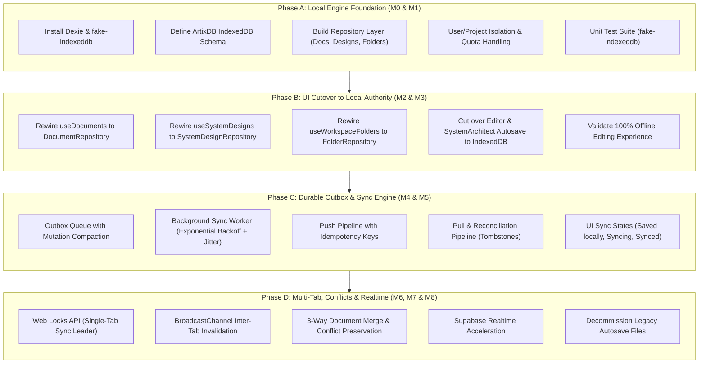

# 🚀 Artix Local-First Engine: Master Roadmap & Phase A Implementation Plan

> **Scope:** Architectural evaluation of `Artix_Offline_First_Infrastructure_and_Synchronization_Plan.md` against the current codebase, definition of the 4-phase master roadmap, and execution-ready plan for **Phase A (Milestones M0 & M1: Local Database Foundation & Repositories)**.

---

## 1. Architectural Evaluation & Codebase Alignment

The suggested 2032-line plan (`Artix_Offline_First_Infrastructure_and_Synchronization_Plan.md`) represents an enterprise-grade offline-first architecture (modeled after Linear, Obsidian, and Figma). Below is our forensic evaluation against the current `main` codebase:

### 1.1 Where the Codebase Stands Today
1. **Network-Bound CRUD:**
   - [`src/hooks/useDocuments.tsx`](file:///c:/Fenix-main/src/hooks/useDocuments.tsx), [`src/hooks/useSystemDesigns.tsx`](file:///c:/Fenix-main/src/hooks/useSystemDesigns.tsx), and [`src/hooks/useWorkspaceFolders.tsx`](file:///c:/Fenix-main/src/hooks/useWorkspaceFolders.tsx) query and mutate Supabase directly via `@tanstack/react-query`.
   - If the user is offline, creates and updates immediately fail with network toasts.
2. **Persistence Fragmentation:**
   - Document drafts live in `localStorage` via `autosave.ts` and `debouncedSave.ts`.
   - Workspace tabs live in `localStorage` via `tabPersistence.ts`.
   - System designs rely solely on debounced Supabase writes without local draft persistence.
3. **Existing Architectural Strengths:**
   - **Unified Resource Model:** [`src/lib/workspace/resourceAdapter.ts`](file:///c:/Fenix-main/src/lib/workspace/resourceAdapter.ts) already normalizes documents and designs into `WorkspaceResource`.
   - **Single-Mount Viewport:** [`ProjectWorkspace.tsx`](file:///c:/Fenix-main/src/pages/ProjectWorkspace.tsx) only mounts the active editor, making memory management predictable.
   - **Dirty Tracker:** [`src/lib/workspace/dirtyTracker.ts`](file:///c:/Fenix-main/src/lib/workspace/dirtyTracker.ts) tracks unsaved changes in memory.
   - **Optimistic Concurrency Baseline:** Existing Supabase updates already check `updated_at`.

### 1.2 The Strategic Phased Abstraction
Because the complete offline-first vision spans IndexedDB, Outboxes, Mutation Compaction, 2-Way Sync, Conflict Resolution, Web Locks, and Realtime accelerators, **attempting to implement it in a single monolithic plan would create massive blast radius and regressions**.

We abstract the 2032-line document into **4 Executable Implementation Plans**:



---

## 2. Phase A Detailed Plan: Local Storage Engine & Repository Layer

**Goal:** Establish a robust, typed, transactional IndexedDB foundation using **Dexie.js** and build clean, isolated repository classes for all workspace entities without altering the live UI yet.

### User Review Required
> [!IMPORTANT]
> **Dependency Selection:** We propose adding `dexie` (`^4.0.11`) as a runtime dependency and `fake-indexeddb` (`^6.0.0`) as a devDependency. Dexie is the gold-standard TypeScript wrapper for IndexedDB, offering zero-overhead transactions, robust schema migrations, and active browser compatibility.
>
> **Isolation Guarantee:** Phase A will NOT break or modify existing UI components (`Editor`, `SystemArchitect`, `ProjectWorkspace`). It introduces the local storage engine in isolation with comprehensive unit tests before any live UI cutover.

### Open Questions
None. The architecture strictly follows the specifications defined in `Artix_Offline_First_Infrastructure_and_Synchronization_Plan.md`.

---

## 3. Proposed Changes (Phase A)

### 3.1 Dependencies
#### [MODIFY] [`package.json`](file:///c:/Fenix-main/package.json)
- Add `dexie` to `dependencies`.
- Add `fake-indexeddb` to `devDependencies`.

---

### 3.2 Local Database Layer (`src/lib/local/`)

#### [NEW] [`src/lib/local/types.ts`](file:///c:/Fenix-main/src/lib/local/types.ts)
- `LocalDocument`: Extends domain Document with `localRevision: number`, `projectId: string`, `userId: string`, `isDeleted: boolean`.
- `LocalSystemDesign`: Extends domain SystemDesign with `localRevision: number`, `projectId: string`, `userId: string`, `isDeleted: boolean`.
- `LocalWorkspaceFolder`: Extends domain WorkspaceFolder with `localRevision: number`, `projectId: string`, `userId: string`, `isDeleted: boolean`.
- `OutboxEntry`: Typed mutation queue item (`id`, `entityType`, `entityId`, `operation`, `baseServerVersion`, `localRevision`, `payload`, `state`, `attemptCount`, `createdAt`).
- `SyncMetadata`: Per-entity sync checkpoint (`entityType`, `entityId`, `serverVersion`, `serverUpdatedAt`, `localRevision`, `syncState`, `lastSyncedAt`).
- `ConflictRecord`: Preserved conflict state (`id`, `entityType`, `entityId`, `basePayload`, `localPayload`, `remotePayload`, `detectedAt`).

#### [NEW] [`src/lib/local/db.ts`](file:///c:/Fenix-main/src/lib/local/db.ts)
- `ArtixDB` class extending `Dexie`:
  - Stores:
    - `documents`: `id, [userId+projectId], folderId, localRevision, updatedAt, isDeleted`
    - `system_designs`: `id, [userId+projectId], folderId, localRevision, updatedAt, isDeleted`
    - `workspace_folders`: `id, [userId+projectId], parentFolderId, localRevision, name, isDeleted`
    - `outbox`: `id, [entityType+entityId], state, createdAt, localRevision`
    - `sync_metadata`: `[entityType+entityId], syncState, localRevision`
    - `conflicts`: `id, [entityType+entityId], detectedAt`
  - Singleton factory `getArtixDB(userId: string)` ensuring user-scoped isolation.
  - Safe database closing and quota monitoring (`getStorageEstimate()`).

#### [NEW] [`src/lib/local/errors.ts`](file:///c:/Fenix-main/src/lib/local/errors.ts)
- Custom error hierarchy: `LocalStorageError`, `StorageQuotaExceededError`, `EntityNotFoundError`, `DatabaseClosedError`.

---

### 3.3 Repository Abstraction Layer (`src/lib/repositories/`)

#### [NEW] [`src/lib/repositories/documentRepository.ts`](file:///c:/Fenix-main/src/lib/repositories/documentRepository.ts)
- `DocumentRepository`:
  - `getById(id: string): Promise<LocalDocument | null>`
  - `listByProject(projectId: string): Promise<LocalDocument[]>`
  - `create(doc: CreateDocumentDTO): Promise<LocalDocument>` (increments localRevision, generates client UUID)
  - `update(id: string, updates: Partial<LocalDocument>): Promise<LocalDocument>` (increments localRevision)
  - `delete(id: string): Promise<void>` (soft delete via `isDeleted = true`)
  - `hardDelete(id: string): Promise<void>`

#### [NEW] [`src/lib/repositories/systemDesignRepository.ts`](file:///c:/Fenix-main/src/lib/repositories/systemDesignRepository.ts)
- `SystemDesignRepository`:
  - CRUD operations for large board states (`nodes`, `edges`, `strokes`).

#### [NEW] [`src/lib/repositories/folderRepository.ts`](file:///c:/Fenix-main/src/lib/repositories/folderRepository.ts)
- `WorkspaceFolderRepository`:
  - CRUD operations for hierarchical folder tree, parent folder re-assignment, and name collision validation.

---

### 3.4 Automated Verification Suite (`src/test/local/`)

#### [NEW] [`src/test/local/db.test.ts`](file:///c:/Fenix-main/src/test/local/db.test.ts)
- Tests Dexie schema initialization, user isolation, and multi-store transactions using `fake-indexeddb`.

#### [NEW] [`src/test/local/documentRepository.test.ts`](file:///c:/Fenix-main/src/test/local/documentRepository.test.ts)
- Tests CRUD, local revision increments, soft deletion, and query filtering.

#### [NEW] [`src/test/local/systemDesignRepository.test.ts`](file:///c:/Fenix-main/src/test/local/systemDesignRepository.test.ts)
- Tests large board state serialization, node/edge updates, and local revision progression.

#### [NEW] [`src/test/local/folderRepository.test.ts`](file:///c:/Fenix-main/src/test/local/folderRepository.test.ts)
- Tests nested folder creation, reparenting, and project filtering.

---

## 4. Verification Plan

### Automated Tests
1. Run existing test suite to ensure zero regressions:
   ```bash
   npm test -- --run
   ```
   (Must maintain all 329 passing tests).
2. Run newly added local engine test suites:
   ```bash
   npm test -- src/test/local/ --run
   ```
3. Type-check:
   ```bash
   npx tsc --noEmit
   ```
4. Production build:
   ```bash
   npm run build
   ```

### Manual Verification
- Verify IndexedDB initialization in browser DevTools Application tab.
